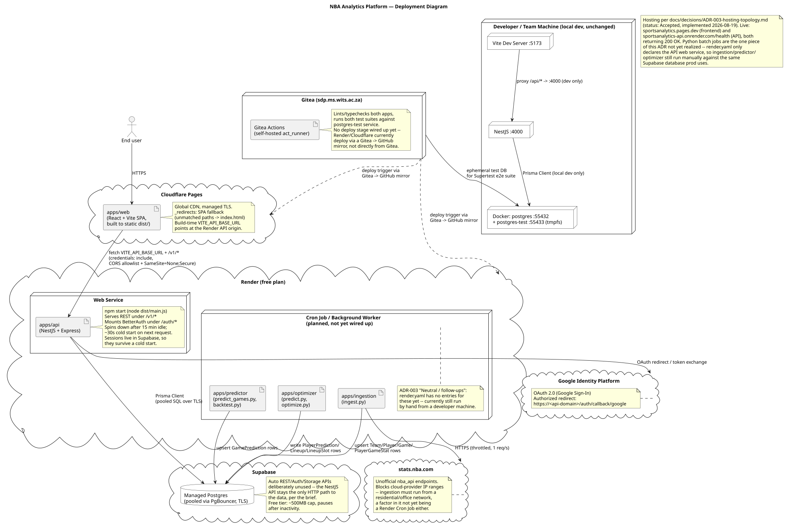
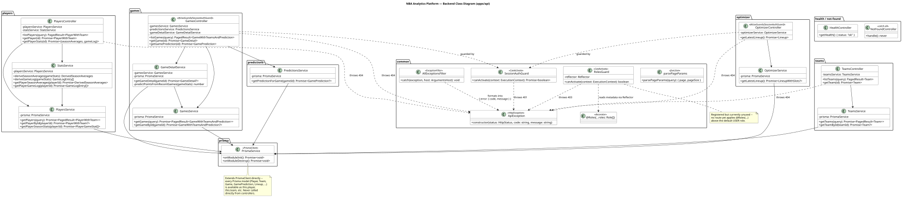
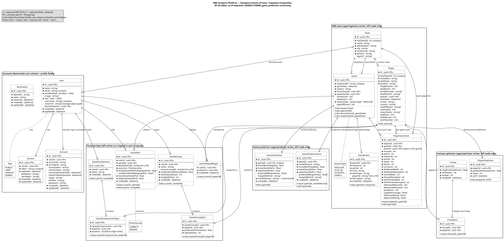
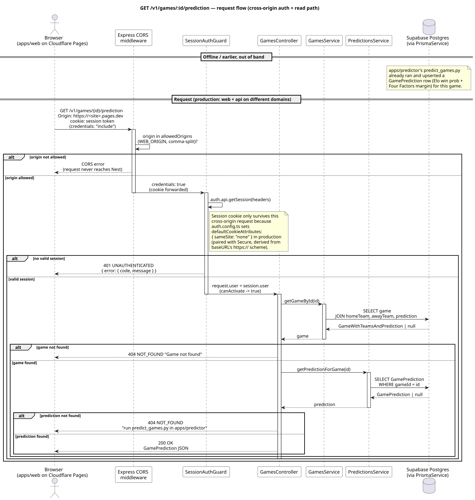

# Architecture Overview

## Deployment diagram

This satisfies the brief's non-monolithic requirement (§2.1): `apps/web` and `apps/api` are separate, independently deployed applications that only communicate over HTTP — confirmed directly from the code (`apiClient.ts` calls `fetch` against `VITE_API_BASE_URL`, nothing shares in-process state). The three Python services (`ingestion`, `predictor`, `optimizer`) write directly to Postgres as separate processes, never through the API.

Generated from [ADR-003](../decisions/adr-003-hosting-topology.md) and the current `apps/api`/`apps/web` source (PlantUML source in the main app repo's `docs/diagrams/deployment.puml`). Shows the full production path (Cloudflare Pages → Render → Supabase), the OAuth and unofficial `stats.nba.com` dependencies, local dev as a separate parallel path, and CI. As of this diagram, the Python batch jobs (`ingestion`/`predictor`/`optimizer`) are still run manually from a developer machine — `render.yaml` only declares the API web service, not the Cron Jobs/Background Workers this page's table below still lists as "planned."

### Class diagram

The `apps/api` controller/service/guard structure: each feature module's controller depends on its own service(s), every service goes through the single `PrismaService`, and `SessionAuthGuard`/`RolesGuard` sit in front of the auth-gated controllers (Games, Optimizer). `RolesGuard` is wired up and tested but not yet used by any route — no endpoint currently requires a role above the default `USER`.

### Database ERD

!!! warning "Diagram not regenerated — schema has grown substantially since"
    The schema is now 31 models and 6 enums (`schema.prisma`, checked 2026-09-23), not the 20 tables/3 enums this diagram and its caption originally described. The image above has not been regenerated against the current schema and should not be trusted for exact table names/relationships until it is — see [ERD](erd.md) and `apps/api/prisma/schema.prisma` directly in the meantime.

Grouped by which part of the system writes to them: user accounts (`User`, `Session`, `Account`, `Verification`), NBA data written by the ingestion scripts (`Team`, `Player`, `Game`, `GameEvent`, `PlayerGameStat`), the submission/review layer (`IngestionBatch`, `EventCorrection`), game predictions written by the predictor (`GamePrediction`, `GamePredictionRun`), fantasy lineups written by the optimizer (`PlayerPrediction`, `Lineup`, `LineupSlot`), the API-consumer layer (`ApiConsumer`, `ApiKey`, `ApiUsageLog`), dataset releases (`DatasetRelease`), analyst-defined statistics (`CustomStatistic`), the ingestion job queue (`IngestionRequest`, `IngestionWorker`), and personal data the API writes when a signed-in user saves something (`UserFollowedPlayer`, `GamePick`, `SavedComparison`, `SavedComparisonPlayer`, `SavedLineup`, `SavedLineupSlot`, and more added since). See [ERD](erd.md) for what every column means, and [ADR-001: Database](../decisions/adr-001-database.md) for why the schema is designed this way.

### Sequence diagram: `GET /v1/games/:id/prediction`

Walks a single auth-gated request end to end, including why it works cross-origin in production (Cloudflare Pages calling Render): the CORS middleware checks the request's `Origin` against the `WEB_ORIGIN` allowlist before it ever reaches Nest, and the session cookie survives the cross-site request only because `auth.config.ts` sets `defaultCookieAttributes: { sameSite: "none" }` in production (paired with `Secure`, derived from `baseURL`'s `https://` scheme). Also shows the two-step 404 (game not found vs. game found but not yet predicted) and that the `GamePrediction` row itself comes from an out-of-band `apps/predictor` run, never from this request. See [API Design](api-design.md) for the full endpoint table.

## Frontend (`apps/web`)

- **React + Vite**, **Tailwind CSS v4** (via `@theme` custom properties in `index.css`, not the older `tailwind.config.js` token approach).
- **React Router** — grown well past the original eight routes: `/` (landing), `/onboarding`, `/profile` (API keys live here now, `/api-keys` redirects), `/home` (signed-in dashboard), `/players`, `/players/:playerId`, `/compare`, `/teams`, `/teams/:teamId`, `/datasets`, `/optimizer` (signed-in), `/predictions` (signed-in), `/games/:gameId`, `/admin` (`ADMIN` role).
- **Recharts** — `RadarChart` (player traits) and `LineChart` (points trend), both themed against the same CSS variables as the rest of the UI.
- **TanStack Query** for data-fetching/caching against the API.
- **shadcn/ui** for component library, paired with Tailwind.
- All backend calls go through `lib/apiClient.ts`, a single `fetchJson<T>` wrapper — one place controls the base URL and request options.
- `credentials: "include"` on every request for cookie-based auth.
- **Top navbar** with five nav links (Home, Players, Teams, Optimizer, Predictions), a recent-result widget, and an auth status button.
- **Court view** visualisation for predicted top scorers by position on a basketball court.
- Deployed on **Cloudflare Pages** (global CDN, managed TLS, auto-deploy from GitHub mirror).

## Backend (`apps/api`)

- **NestJS** on top of **Prisma** and **PostgreSQL (Supabase)** — see [ADR-001](../decisions/adr-001-database.md).
- **BetterAuth** (Google OAuth) for auth — see [ADR-002](../decisions/adr-002-auth.md). BetterAuth mounts its own route set at `/api/auth/*`.
- Routes are versioned under `/v1/` — see [API Design](api-design.md) for the full endpoint table.
- **Auth-gated endpoints**: predictions and optimizer endpoints require an authenticated session (`SessionAuthGuard`). Players, teams, games, analytics, and datasets are public reads — but "public" no longer means "no auth at all": since PR #172, every request to those routes needs *either* a signed-in session *or* a valid `X-API-Key` (`OptionalSessionGuard` + `ApiKeyGuard`), so a truly anonymous, keyless request gets `401 API_KEY_REQUIRED`. Admin endpoints (`/v1/admin/*`) require the `ADMIN` role via `RolesGuard` — the first real use of the role infrastructure, wired up once the admin corrections/consumer-management features landed.
- **Response cache** — a small in-process cache (`apps/api/src/cache/`) in front of public reads, with no external cache service. Nothing under `/v1/me` is cached. See [Performance](performance.md) and [ADR-004](../decisions/adr-004-caching-strategy.md).
- **Health check** at `/health` for Render liveness probes.
- Deployed on **Render** (Node.js web service, free tier). A pinger service keeps the instance warm to avoid cold-start delays.

## Python services

Three Python services run alongside the TypeScript apps, writing directly to Postgres:

- **`apps/ingestion`** — `nba_api` client that fetches teams, rosters, games, and box scores into Postgres. Orchestrated by `ingest.py`, which now writes real per-play `GameEvent` rows (not just bookend markers) and can land a batch as `PENDING_REVIEW` for admin approval (`--review`) instead of auto-publishing. `pull_worker.py` polls an `IngestionRequest` queue so an admin can trigger a pull from the web app on a host that can't run `nba_api` calls directly (Render, per stats.nba.com's cloud-IP blocking — see [Getting Started](../getting-started.md)). Built during Sprint 1 (week of 18 Aug); the review/queue/event-derivation work above landed in Sprint 3.
- **`apps/predictor`** — computes Elo-based home win probability and Four Factors-based predicted score margin for each game. Writes to the `GamePrediction` table.
- **`apps/optimizer`** — predicts per-player fantasy points and solves a 5-player lineup under a salary cap via MILP (PuLP/CBC). Writes to `PlayerPrediction`, `Lineup`, and `LineupSlot` tables.

These are planned to run as Render Cron Jobs or Background Workers in production.

## Local development

**Docker Compose** runs Postgres locally; both apps run with their own dev server (`npm run start:dev` / `npm run dev`) against it — see [Getting Started](../getting-started.md).

## Deployment topology

Production hosting per [ADR-003](../decisions/adr-003-hosting-topology.md):

| Component | Host | URL | Deploy method |
|---|---|---|---|
| Frontend (`apps/web`) | Cloudflare Pages | [sportsanalytics.pages.dev](https://sportsanalytics.pages.dev/) | Auto-deploy from GitHub mirror |
| API (`apps/api`) | Render | [sportsanalytics-api.onrender.com/health](https://sportsanalytics-api.onrender.com/health) | Auto-deploy from GitHub mirror |
| Database | Supabase (managed Postgres) | — | Direct connection from API and Python services |
| Python services | Render (Cron/Worker, planned) | — | Manual or scheduled |
| CI | Gitea Actions | — | Lint, typecheck, test on every push/PR |
| Docs site | GitHub Pages | [sports-analytics-innovation-platform.github.io/Innovation-Documentation-Website](https://sports-analytics-innovation-platform.github.io/Innovation-Documentation-Website/) | Auto-deploy on push to `main` |

---

*AI Declaration: The preceding document was generated with the assistance of the following: Claude-Web[Claude Sonnet 5], Qoder[Qoder Lite], Claude-Code[Claude Sonnet 5]*
