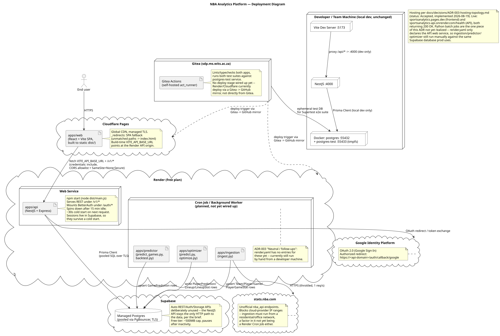
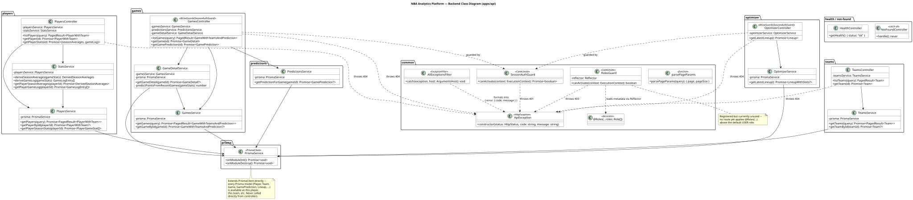
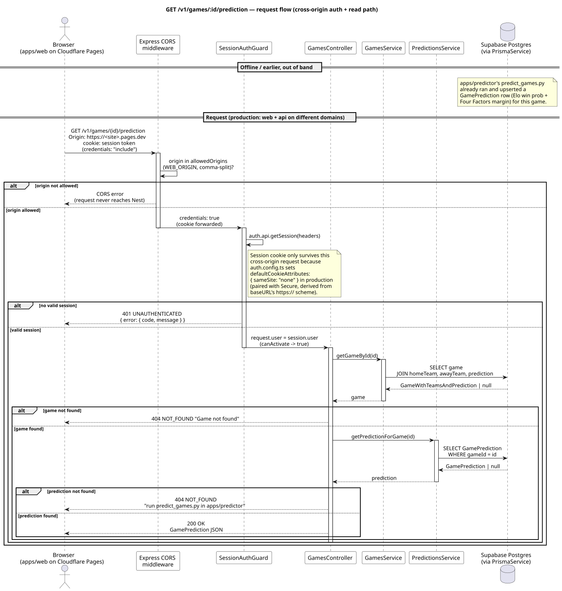

# Architecture Overview

## Deployment diagram

This satisfies the brief's non-monolithic requirement (§2.1): `apps/web` and `apps/api` are separate, independently deployed applications that only communicate over HTTP — confirmed directly from the code (`apiClient.ts` calls `fetch` against `VITE_API_BASE_URL`, nothing shares in-process state). The Python services (`ingestion`, `predictor`, `optimizer`, and since PR #192 `valuation`) write directly to Postgres as separate processes, never through the API.

!!! success "Regenerated against the current source — 2026-10-03"
    The deployment, class and sequence diagrams below were rebuilt from the current `apps/api`/`apps/web` source (three parallel research passes over the module structure, the Python pipelines, and the actual guard/request flow). Each replaces an older diagram that had drifted from the code; the old versions are kept further down this page for history.

PlantUML source in the main app repo's `docs/diagrams/deployment.puml`. Shows the full production path (Cloudflare Pages → Pages Functions proxy → Render → Supabase), the OAuth and unofficial `stats.nba.com` dependencies, local dev as a separate parallel path, and CI. The Pages Functions proxy is drawn as its own node because it does real work: it strips the `/api` prefix and injects a first-party `X-API-Key` so a signed-out browser can still reach public read routes. Ingestion (`ingest.py`) is the only Python job with any automated trigger — spawned directly by the API in local dev, or queued as an `IngestionRequest` for `pull_worker.py` when deployed (stats.nba.com blocks Render's IPs). `predictor`/`optimizer`/`valuation` have no scheduler or queue at all; they're run manually, on whatever machine an operator chooses, whenever the underlying game data changes.

### Class diagram

The real module list (15 feature modules under `apps/api/src/`, not the earlier diagram's invented groupings): each controller's actual guard combination is labelled — `SessionAuthGuard` alone for signed-in-only routes, `OptionalSessionGuard` + `ApiKeyGuard` for public reads (session or API key, never a bare 401 for an anonymous request), `SessionAuthGuard` + `RolesGuard` for the nine `/v1/admin/*` controllers. `RolesGuard` is in active use — every admin controller requires `Role.ADMIN`, and `CustomStatisticsController` requires `ANALYST` or `ADMIN`. Also shows real cross-module reuse that isn't obvious from the folder layout: `TeamsModule` injects `PlayersService`/`StatsService` directly rather than importing `PlayersModule`, and both import `GamesModule` for `GamesService`.

### Database ERD

Regenerated 2026-10-03 and split into three diagrams for readability — see [ERD](erd.md#diagram) for all three (core NBA data, user state, operations/Become Pro) and what each covers.

### Sequence diagram: `GET /v1/games/:id/prediction`

Corrected 2026-10-03: this route is **not** session-required. It uses `OptionalSessionGuard` (attaches the user if a valid session cookie is present, never rejects) followed by `ApiKeyGuard` (only runs its checks if no session was found) — so a signed-out browser reaches it successfully because the Cloudflare Pages Functions proxy (or the Vite dev proxy locally) injects a first-party `X-API-Key` on every request that didn't already carry one. A truly keyless, sessionless request gets `401 API_KEY_REQUIRED`; an invalid/inactive key gets `401 UNAUTHORIZED`; over the consumer's rate limit or daily quota gets `429`. The diagram also no longer shows a separate `PredictionsService` — the current code reads the prediction from the same single `GamesService.getGameById` query that loads the game, teams and market odds, not a second round trip. Still shows the two-step 404 (game not found vs. game found but not yet predicted) and that the `GamePrediction` row itself comes from an out-of-band `apps/predictor` run, never from this request. See [API Design](api-design.md) for the full endpoint table.

### Sequence diagram: admin event correction

New 2026-10-03 — this flow didn't exist when the other sequence diagram was first drawn. Covers the three-step admin correction workflow end to end: a dry-run preview (`POST .../preview`, no writes), the confirmed write (`POST .../correct`, which locks the game row, re-derives every affected player's `PlayerGameStat`, marks that season's dataset releases stale, and inserts one `EventCorrection` audit row, all in one transaction), and an undo (`POST /v1/admin/corrections/:id/revert`), which never deletes history — it applies the original's `previousValues` as a brand-new correction linked back via `revertsCorrectionId`. Shows every 4xx/409 branch: missing session, wrong role, malformed body, game/event not found, a rule violation, or — on undo — a later correction touching the same fields, or the play having changed since (re-ingested).

### Superseded diagrams

??? note "Pre-Sprint-3 deployment, class and sequence diagrams"
    Kept for history. These predate the admin corrections, datasets, custom statistics, pull-queue and Become Pro features, and the deployment diagram predates the Cloudflare Pages Functions proxy being drawn explicitly.

    

    

    

## Frontend (`apps/web`)

- **React + Vite**, **Tailwind CSS v4** (via `@theme` custom properties in `index.css`, not the older `tailwind.config.js` token approach).
- **React Router** — grown well past the original eight routes: `/` (landing), `/onboarding`, `/profile` (API keys live here now, `/api-keys` redirects), `/home` (signed-in dashboard), `/players`, `/players/:playerId`, `/compare`, `/teams`, `/teams/:teamId`, `/datasets`, `/become-pro` (signed-in, private to its owner), `/optimizer` (signed-in), `/predictions` (signed-in), `/games/:gameId`, `/admin` (`ADMIN` role).
- **Recharts** — `RadarChart` (player traits) and `LineChart` (points trend), both themed against the same CSS variables as the rest of the UI.
- **TanStack Query** for data-fetching/caching against the API.
- **shadcn/ui** for component library, paired with Tailwind.
- All backend calls go through `lib/apiClient.ts`, a single `fetchJson<T>` wrapper — one place controls the base URL and request options.
- `credentials: "include"` on every request for cookie-based auth.
- **Top navbar** with eight nav links (Home, Players, Compare, Teams, Datasets, Optimizer, Predictions, Become Pro, plus Admin for admins), a recent-result widget, and an auth status button. See [UI Overview](wireframes.md#navigation).
- **Court view** visualisation for predicted top scorers by position on a basketball court.
- Deployed on **Cloudflare Pages** (global CDN, managed TLS, auto-deploy from GitHub mirror).

## Backend (`apps/api`)

- **NestJS** on top of **Prisma** and **PostgreSQL (Supabase)** — see [ADR-001](../decisions/adr-001-database.md).
- **BetterAuth** (Google OAuth) for auth — see [ADR-002](../decisions/adr-002-auth.md). BetterAuth mounts its own route set at `/api/auth/*`.
- Routes are versioned under `/v1/` — see [API Design](api-design.md) for the full endpoint table.
- **Auth-gated endpoints**: predictions and optimizer endpoints require an authenticated session (`SessionAuthGuard`). Players, teams, games, analytics, and datasets are public reads — but "public" no longer means "no auth at all": since PR #172, every request to those routes needs *either* a signed-in session *or* a valid `X-API-Key` (`OptionalSessionGuard` + `ApiKeyGuard`), so a truly anonymous, keyless request gets `401 API_KEY_REQUIRED`. Admin endpoints (`/v1/admin/*`) require the `ADMIN` role via `RolesGuard` — the first real use of the role infrastructure, wired up once the admin corrections/consumer-management features landed.
- **Response cache** — a small in-process cache (`apps/api/src/cache/`) in front of public reads, with no external cache service. Nothing under `/v1/me` is cached. See [Performance](performance.md) and [ADR-004](../decisions/adr-004-caching-strategy.md).
- **Become Pro module** (`apps/api/src/become-pro/`) — the session-guarded `/v1/me/become-pro` routes. It derives a user's season line with the same `deriveSeasonAverages` code as the NBA player pages, and re-values the season against the newest `ProspectValuationModel` (trained by `apps/valuation`) on every game write. See [Become Pro](../become-pro/index.md).
- **Health check** at `/health` for Render liveness probes.
- Deployed on **Render** (Node.js web service, free tier). A pinger service keeps the instance warm to avoid cold-start delays.

## Python services

Four Python services run alongside the TypeScript apps, writing directly to Postgres:

- **`apps/ingestion`** — `nba_api` client that fetches teams, rosters, games, and box scores into Postgres. Orchestrated by `ingest.py`, which now writes real per-play `GameEvent` rows (not just bookend markers) and can land a batch as `PENDING_REVIEW` for admin approval (`--review`) instead of auto-publishing. `pull_worker.py` polls an `IngestionRequest` queue so an admin can trigger a pull from the web app on a host that can't run `nba_api` calls directly (Render, per stats.nba.com's cloud-IP blocking — see [Getting Started](../getting-started.md)). Built during Sprint 1 (week of 18 Aug); the review/queue/event-derivation work above landed in Sprint 3.
- **`apps/predictor`** — computes Elo-based home win probability and Four Factors-based predicted score margin for each game. Writes to the `GamePrediction` table.
- **`apps/optimizer`** — predicts per-player fantasy points and solves a 5-player lineup under a salary cap via MILP (PuLP/CBC). Writes to `PlayerPrediction`, `Lineup`, and `LineupSlot` tables.
- **`apps/valuation`** — fits a least-squares model on real NBA rookie seasons mapping a season line to a draft pick, and writes it, with the rookie scale and level factors, as one `ProspectValuationModel` row. Unlike the other three, its output is not served as it stands: the API applies the stored model to each user's Become Pro season whenever that season changes. See [Valuation Model](../become-pro/valuation-model.md). Added in PR #192.

These are planned to run as Render Cron Jobs or Background Workers in production.

## Local development

**Docker Compose** runs Postgres locally; both apps run with their own dev server (`npm run start:dev` / `npm run dev`) against it — see [Getting Started](../getting-started.md).

## Deployment topology

Production hosting per [ADR-003](../decisions/adr-003-hosting-topology.md):

| Component | Host | URL | Deploy method |
|---|---|---|---|
| Frontend (`apps/web`) | Cloudflare Pages | [sportsanalytics.pages.dev](https://sportsanalytics.pages.dev/) | Auto-deploy from GitHub mirror |
| API (`apps/api`) | Render | [sportsanalytics-api.onrender.com/health](https://sportsanalytics-api.onrender.com/health) | Auto-deploy from GitHub mirror |
| Database | Supabase (managed Postgres) | — | Direct connection from API and Python services |
| Python services | Render (Cron/Worker, planned) | — | Manual or scheduled |
| CI | Gitea Actions | — | Lint, typecheck, test on every push/PR |
| Docs site | GitHub Pages | [sports-analytics-innovation-platform.github.io/Innovation-Documentation-Website](https://sports-analytics-innovation-platform.github.io/Innovation-Documentation-Website/) | Auto-deploy on push to `main` |

---

*AI Declaration: The preceding document was generated with the assistance of the following: Claude-Web[Claude Sonnet 5], Qoder[Qoder Lite], Claude-Code[Claude Sonnet 5], Claude-Code[Claude Opus 5.5]*
