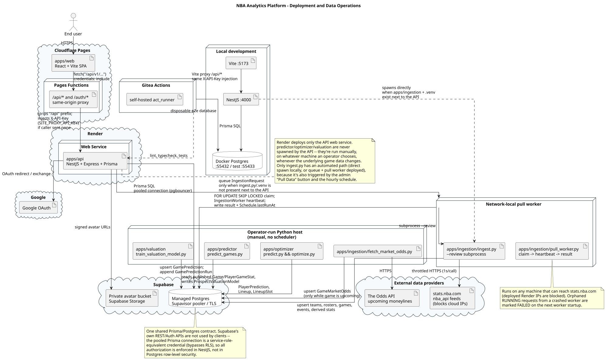
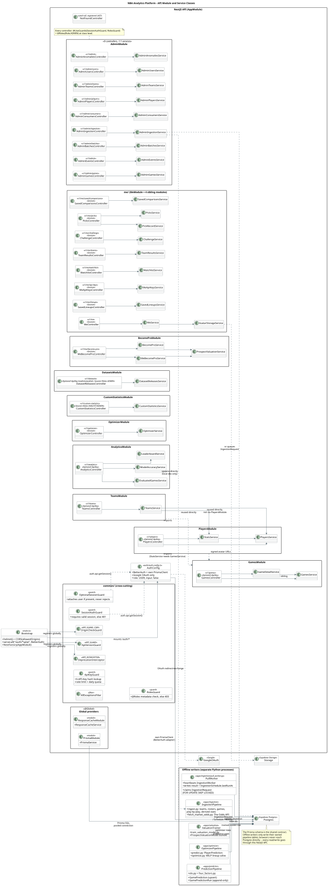
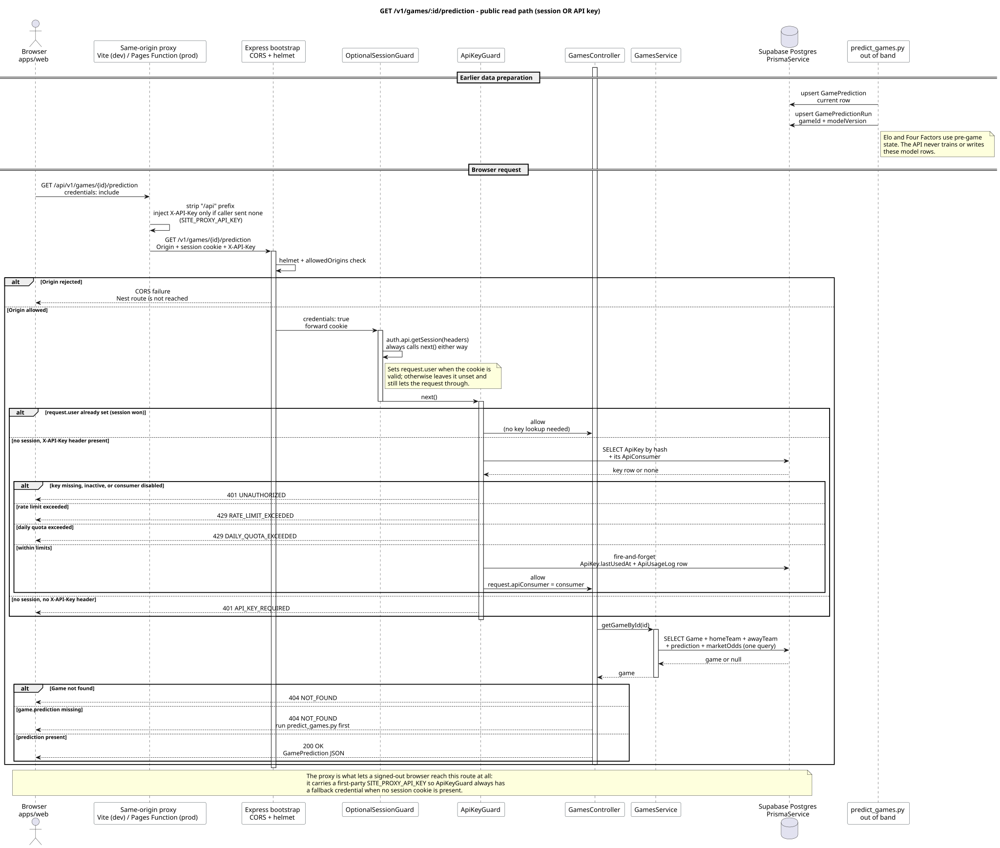
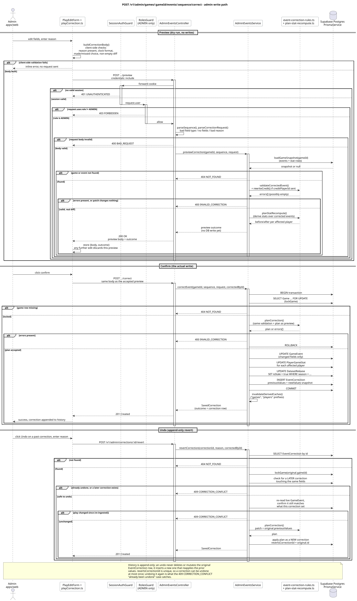

# Architecture Overview

The platform is not a monolith. The web app (`apps/web`) and the API (`apps/api`) are separate applications, deployed separately, that talk only over HTTP. Python services write to Postgres as separate processes and never go through the API.

| Component | What it is | Host |
|---|---|---|
| `apps/web` | React single-page app | Cloudflare Pages ([sportsanalytics.pages.dev](https://sportsanalytics.pages.dev/)) |
| `apps/api` | NestJS REST API, versioned under `/v1/` | Render ([Swagger UI](https://sportsanalytics-api.onrender.com/api/docs)) |
| Database | PostgreSQL with Prisma | Supabase |
| `apps/ingestion`, `apps/predictor`, `apps/optimizer`, `apps/valuation`, `apps/similarity` | Python batch jobs | Run from a team member's machine |
| CI | Lint, typecheck and tests on every push | Gitea Actions |
| Docs | This site | GitHub Pages |

Why these hosts: [ADR-003: Hosting Topology](../decisions/adr-003-hosting-topology.md).

## Deployment diagram

Regenerated against the current source on 3 Oct 2026. The production path is Cloudflare Pages → Pages Functions proxy → Render → Supabase. The proxy serves `/api` and `/auth` on the web app's own origin, so the session cookie is first-party, and it adds a first-party `X-API-Key` so a signed-out browser can still read public routes. Ingestion runs on a team member's machine because stats.nba.com blocks cloud networks: the API queues a pull and the pull worker runs it ([Data Ingestion](ingestion.md)). Ingestion is the only Python job with any trigger; the predictor, optimizer and valuation jobs are run by hand when the game data changes.

## Frontend (`apps/web`)

- **React 19 and Vite**, **Tailwind CSS v4** (theme tokens in `index.css`) and shadcn/ui components.
- **React Router** with 16 routes. The [UI Overview](wireframes.md#pages) lists them.
- **TanStack Query** for fetching and caching. Every call goes through one wrapper in `lib/apiClient.ts`, with `credentials: "include"` for the session cookie.
- **Recharts** for the traits radar and the points trend.

## Backend (`apps/api`)

- **NestJS, Prisma and PostgreSQL** ([ADR-001](../decisions/adr-001-database.md)). One module per feature, each with a controller and a service; every service uses the shared `PrismaService`.
- **BetterAuth** with Google OAuth, mounted at `/auth/*` ([ADR-002](../decisions/adr-002-auth.md)).
- **Guards:** public reads need a session or an `X-API-Key`; `/v1/me/*` and the optimizer need a session; `/v1/admin/*` needs the `ADMIN` role (`RolesGuard`). The [API Reference](../api-reference.md#authentication) has the details.
- **One error envelope** for every error response ([API Design](api-design.md)).
- **An in-process response cache** for public reads ([ADR-004](../decisions/adr-004-caching-strategy.md), [Performance](performance.md)).
- **Health check** at [`/v1/health`](https://sportsanalytics-api.onrender.com/v1/health). A pinger keeps the free Render instance warm.

### Class diagram

Regenerated on 3 Oct 2026 from the 15 feature modules under `apps/api/src/`. Controllers depend on their services, and every service goes through `PrismaService`. Each controller is labelled with its guards: `SessionAuthGuard` for signed-in routes, `OptionalSessionGuard` and `ApiKeyGuard` for public reads, and `SessionAuthGuard` with `RolesGuard` for the nine `/v1/admin/*` controllers (`ADMIN`). `CustomStatisticsController` requires `ANALYST` or `ADMIN`. `TeamsModule` uses `PlayersService` and `StatsService` directly, and both modules import `GamesModule`.

### Sequence diagram: `GET /v1/games/:id/prediction`

One request end to end, corrected on 3 Oct 2026. The route does not require a session: `OptionalSessionGuard` attaches the user if a session cookie is present, and `ApiKeyGuard` then checks for a key only if there is no session. A signed-out browser gets through because the Pages Functions proxy (or the Vite dev proxy locally) adds a first-party `X-API-Key`. With neither a session nor a key the response is `401 API_KEY_REQUIRED`; an invalid or inactive key gets `401 UNAUTHORIZED`; going over the rate limit or daily quota gets `429`. `GamesService.getGameById` loads the game, teams, odds and prediction in one query. There are two different 404s (no such game, or no prediction yet). The prediction itself is written earlier by `apps/predictor`, never during the request.

### Sequence diagram: admin event correction

Added on 3 Oct 2026. An admin previews a correction (`POST .../preview`, no writes), then confirms it (`POST .../correct`). The confirmed write locks the game row, re-derives the affected players' `PlayerGameStat` rows, marks that season's dataset releases stale and adds one `EventCorrection` row, all in one transaction. An undo (`POST /v1/admin/corrections/:id/revert`) never deletes history: it applies the original's `previousValues` as a new correction linked back through `revertsCorrectionId`. The diagram shows each error case: no session, wrong role, a malformed body, game or play not found, a rule violation, and, on undo, a later correction to the same fields or a play that has changed since it was re-ingested.

### Superseded diagrams

Kept for the record, from before the admin corrections, datasets, custom statistics, pull queue and Become Pro: [deployment](diagrams/deployment-pre-sprint3-superseded.svg), [class](diagrams/class-diagram-pre-sprint3-superseded.svg) and [game prediction sequence](diagrams/sequence-game-prediction-pre-sprint3-superseded.svg).

## Python services

| Service | What it does | Writes to |
|---|---|---|
| `apps/ingestion` | Pulls teams, rosters, games, box scores and play-by-play with `nba_api`. Can land a batch for admin review (`--review`). `pull_worker.py` runs pulls queued from the admin page. | NBA data and ingestion tables |
| `apps/predictor` | Elo win probability and Four Factors margin for each game | `GamePrediction`, `GamePredictionRun` |
| `apps/optimizer` | Projects fantasy points and picks five players under a salary cap with MILP (PuLP/CBC) | `PlayerPrediction`, `Lineup`, `LineupSlot` |
| `apps/valuation` | Fits the Become Pro draft-slot model on real NBA rookie seasons. The API applies it whenever a user's season changes. | `ProspectValuationModel` |
| `apps/similarity` | Groups players into [playing-style archetypes](../player-archetypes/index.md) and finds the five most similar players | `Archetype`, `PlayerArchetype`, `PlayerArchetypeMembership`, `PlayerSimilarity` |

The tables are on the [ERD](erd.md).

## Local development

Docker Compose runs Postgres; the API and the web app each run their own dev server against it. See [Getting Started](../getting-started.md).

---

*AI Declaration: The preceding document was generated with the assistance of the following: Claude-Web[Claude Sonnet 5], Qoder[Qoder Lite], Claude-Code[Claude Sonnet 5], Claude-Code[Claude Opus 5.5]*
