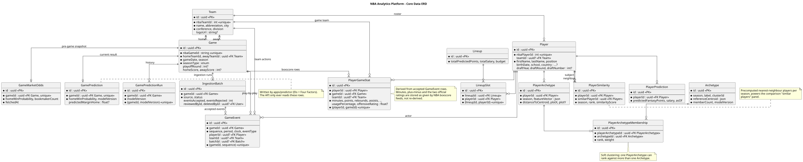

# ERD

This page describes every table in the platform's PostgreSQL database: what each one holds, what its columns mean, and how the tables relate to each other. The reasons behind the design are explained in [ADR-001: Database](../decisions/adr-001-database.md), and where the database runs in [ADR-003: Hosting Topology](../decisions/adr-003-hosting-topology.md).

!!! success "Checked against the schema"
    Every table, column, constraint and index on this page was checked against `apps/api/prisma/schema.prisma` and the migration files in the source repository on 28 September 2026. On `main`, the newest migration is `20260923000000_add_become_pro` and the schema has **35 tables and 7 enums**. The four [Player archetypes](#player-archetypes) tables come from migration `20260922200000_add_player_archetypes`, which is on branch `player-archetypes` and not yet merged. With them, the total is **39 tables**.

!!! info "What changed in Sprint 3 (15–27 September 2026)"
    - **Real play-by-play.** `GameEvent` gained five columns and a unique key, and `PlayerGameStat`'s counting statistics are now derived from it. Play-by-play is stored for 2025-26 only, because of the database's size limit ([ADR-005](../decisions/adr-005-play-by-play-storage.md)).
    - **19 new tables:** the ingestion and review workflow (5), market odds (1), dataset releases, custom statistics and API keys (5), Become Pro (4) and, still in review, player archetypes (4).
    - **The API now edits NBA data**, but only through the admin correction tools, and every correction is logged in `EventCorrection`.

    Every migration is listed in [ADR-001's schema change history](../decisions/adr-001-database.md#schema-change-history).

## Diagram



Click the diagram to enlarge it. The diagram's source file is `docs/diagrams/database-erd.puml` in the source repository. **It shows the 20 tables that existed before Sprint 3.** The 19 tables added since then are described on this page but not yet drawn.

**How to read it**

- `*` marks a required column; `?` marks an optional one that may be empty (`NULL`).
- `PK` is a primary key and `FK` a foreign key (a link to a row in another table).
- Lines below a table's dotted divider list its unique constraints and indexes.
- On the connecting lines, a crow's foot means "many", a bar means "exactly one", and a circle means "zero" is allowed. For example, one team has zero or many players.

## Overview

This page documents **39 tables** and **7 enums** (fixed lists of allowed values), in nine groups. Most groups are written by a single part of the system; where more than one part writes to a group, the table says which writes what.

| Group | Tables | Written by |
|---|---|---|
| [NBA data](#nba-data) | `Team`, `Player`, `Game`, `GameEvent`, `PlayerGameStat` | The ingestion scripts (`apps/ingestion`), which download data from stats.nba.com. The API's admin correction tools also edit `GameEvent` and `PlayerGameStat`. |
| [Ingestion and review](#ingestion-and-review) | `IngestionBatch`, `EventCorrection`, `IngestionRequest`, `IngestionWorker`, `IngestionSchedule` | The ingestion scripts create batches, and admins review or remove them through the API. The API writes corrections, the schedule and queued pulls; the pull worker (`apps/ingestion/pull_worker.py`) claims queued pulls and records itself in `IngestionWorker`. |
| [Game predictions](#game-predictions) | `GamePrediction`, `GamePredictionRun`, `GameMarketOdds` | The predictor script (`apps/predictor`); market odds by `apps/ingestion/fetch_market_odds.py` |
| [Fantasy lineups](#fantasy-lineups) | `PlayerPrediction`, `Lineup`, `LineupSlot` | The optimizer script (`apps/optimizer`) |
| [Player archetypes](#player-archetypes) (in review) | `Archetype`, `PlayerArchetype`, `PlayerArchetypeMembership`, `PlayerSimilarity` | The similarity script (`apps/similarity`) |
| [Accounts](#accounts) | `User`, `Session`, `Account`, `Verification` | BetterAuth, the authentication library |
| [Personal data](#personal-data) | `UserFollowedPlayer`, `GamePick`, `SavedComparison`, `SavedComparisonPlayer`, `SavedLineup`, `SavedLineupSlot` | The API, when a signed-in user saves something |
| [Publishing and API access](#publishing-and-api-access) | `DatasetRelease`, `CustomStatistic`, `ApiConsumer`, `ApiKey`, `ApiUsageLog` | The API: admins publish releases and create external API consumers, analysts define statistics, users create their own API keys, and every request made with a key is logged |
| [Become Pro](#become-pro) | `ProspectSeason`, `ProspectGame`, `ProspectValuation`, `ProspectValuationModel` | The API writes seasons, games and valuations when a user logs their own games; the valuation script (`apps/valuation`) writes the trained model |

The API reads every group. It never writes to the game prediction, fantasy lineup or player archetype tables, or to `ProspectValuationModel`. Its only writes to NBA data come from the admin correction tools. A correction updates one `GameEvent` row, re-derives the `PlayerGameStat` rows of the players that play affects, and records the change in `EventCorrection`, all in one transaction. "Recalculate stats" re-derives a game's `PlayerGameStat` rows from its plays without changing any play.

Unless stated otherwise, every table's primary key is `id`, a generated UUID.

## NBA data

### Team

One row per NBA team.

| Column | Type | Notes |
|---|---|---|
| `nbaTeamId` | int, unique | The NBA's own team ID. Ingestion uses it to update existing teams instead of creating duplicates. |
| `name`, `abbreviation`, `city` | string | For example "Lakers", "LAL", "Los Angeles" |
| `conference`, `division` | string | |
| `logoUrl` | string, optional | Not currently filled in |

### Player

One row per player.

| Column | Type | Notes |
|---|---|---|
| `nbaPlayerId` | int, unique | The NBA's own player ID |
| `firstName`, `lastName`, `position` | string | |
| `heightInches`, `weightLbs` | int, optional | |
| `jerseyNumber`, `headshotUrl` | string, optional | |
| `teamId` | → `Team`, optional | The player's **current** team, from the latest roster. For the team a player played for in a past game, see `PlayerGameStat.teamId`. |
| `birthDate` | datetime, optional | Biography fields, all optional. They come from a separate NBA endpoint and are filled in by a backfill script. |
| `school`, `country`, `lastAffiliation`, `rosterStatus` | string, optional | |
| `seasonExp`, `draftYear`, `draftRound`, `draftNumber` | int, optional | `seasonExp` is years of NBA experience |

**Index:** `teamId`, for loading a team's roster.

### Game

One row per game.

| Column | Type | Notes |
|---|---|---|
| `nbaGameId` | string, unique | The NBA's own game ID |
| `gameDate` | datetime | |
| `season` | string | For example "2025-26" |
| `homeTeamId`, `awayTeamId` | → `Team` | |
| `homeScore`, `awayScore` | int, optional | Empty until the game has been played |
| `seasonType` | `SeasonType`, default `REGULAR` | Regular season, play-in, playoffs or Finals. Every statistics query filters on this, so figures from different parts of the season never mix. All games loaded before this column was added were regular-season games, so the default is correct for them. |
| `playoffRound` | int, optional | 1–4 for playoff and Finals games; empty otherwise |

**Indexes:** `seasonType`; `gameDate`; `(homeTeamId, gameDate)` and `(awayTeamId, gameDate)`, for a team's schedule in date order.

### GameEvent

Play-by-play: one row per action in a game, such as a shot, rebound or foul, from the NBA's `PlayByPlayV3` feed. This is the underlying event record that the brief asks statistics to be traced back to. Every action is checked against the platform's event schema (`apps/ingestion/event_validation.py`) before it is stored. Rejected actions aren't stored; they are counted, by reason, on the game's [`IngestionBatch`](#ingestionbatch).

!!! note "Stored for 2025-26 only"
    One season of play-by-play takes about 320 MB of the free plan's 500 MB, so it is stored for 2025-26 only. 2023-24 and 2024-25 have box scores but no `GameEvent` rows, which also means their plays can't be corrected. See [ADR-005: Play-by-play storage](../decisions/adr-005-play-by-play-storage.md).

| Column | Type | Notes |
|---|---|---|
| `gameId` | → `Game` | |
| `sequence` | int | The NBA's own number for the action, increasing through the game |
| `period` | int | The period the action happened in |
| `clock` | string | Game clock at the time of the action |
| `eventType` | string | The kind of action, for example `2pt`, `rebound` or `turnover` |
| `subType` | string, optional | More detail where the action has it, for example `offensive` or `defensive` on a rebound |
| `playerId` | string, optional | The player's internal id, stored as plain text rather than as a link to `Player`. Empty for team actions such as a team rebound. |
| `teamId` | → `Team`, optional | The team the action belongs to. Empty for actions that belong to neither team. |
| `success` | boolean, optional | Made or missed, for shots and free throws only. Empty for every other action, rather than `false`. |
| `value` | int, optional | Points for a shot or free throw (1, 2 or 3); empty otherwise |
| `description` | string | The NBA's text for the play |
| `batchId` | → `IngestionBatch`, optional | The ingestion run that last wrote this row |
| `createdAt` | datetime | |

**Unique:** `(gameId, sequence)`. Re-ingesting a game updates its plays in place instead of adding duplicates. This replaced a plain index on the same columns on 16 September 2026 (migration `derive_stats_from_game_events`). That migration also deleted every existing row: until then the table held only two placeholder "period start/end" rows per game, and re-runs had been duplicating them.

### PlayerGameStat

One player's box score for one game. Season averages, true shooting percentage, effective field-goal percentage and assist-to-turnover ratio are calculated from these rows each time they are requested (by the API's `/v1/players/:id/stats` route); there is no table of stored averages. Those calculations were checked against the NBA's own published figures and matched to three decimal places.

**Where the figures come from.** For games with play-by-play (2025-26), the counting statistics and the offensive/defensive rebound split are derived from the game's `GameEvent` rows (`apps/ingestion/derive_player_game_stats.py`), falling back to the NBA's official box score for a player who appears in no play. Minutes and plus-minus always come from the official box score, because working out time on court from the plays would mean replaying every substitution. For 2023-24 and 2024-25, which have no play-by-play, the whole row comes from the official box score. When an admin corrects a play, the API re-derives the counting statistics of the players that play affects.

| Column | Type | Notes |
|---|---|---|
| `playerId` | → `Player` | |
| `gameId` | → `Game` | |
| `teamId` | → `Team`, optional | The team the player played for **in this game**, which can differ from their current team after a trade. Empty for some rows loaded before this column was added. |
| `minutes`, `points`, `rebounds`, `assists`, `steals`, `blocks`, `turnovers` | int | |
| `fieldGoalsMade`, `fieldGoalsAttempted` | int | |
| `threesMade`, `threesAttempted` | int | |
| `freeThrowsMade`, `freeThrowsAttempted` | int | |
| `offensiveRebounds`, `defensiveRebounds` | int, optional | Derived from play-by-play rebound actions, so recorded for 2025-26 games only |
| `plusMinus` | int, optional | Points scored minus points conceded while the player was on court |
| `usagePercentage` | float, optional | Share of the team's plays used by the player while on court |
| `offensiveRating`, `defensiveRating` | float, optional | Points produced and allowed per 100 possessions, as published by the NBA |

The optional statistics columns are empty for rows loaded before those columns existed, or where the NBA's data didn't include them. In practice that covers all of 2023-24 and 2024-25: none of those seasons' 49,409 rows has the rebound split or plus-minus, and usage and the two ratings are only loaded for the current season. Empty means "not recorded", which is different from zero; the website shows "—".

**Unique:** `(playerId, gameId)`, so a player has at most one row per game. **Index:** `gameId`, for loading a game's box score.

## Ingestion and review

The records behind getting NBA data in and keeping it correct: one row per ingestion run for a game, one per admin correction, the queue of data pulls waiting for a machine that can reach stats.nba.com, and the automatic-pull schedule. All five were added in Sprint 3. How they are used, including how to run the pull worker, is explained on [Data Ingestion](ingestion.md).

### IngestionBatch

One ingestion run for one game: the pipeline's own "submission", which a published statistic can be traced back to. Every run opens a new row, so earlier runs and their rejections are kept. The one exception is a run that failed: the next run for that game reopens it and continues from its checkpoint.

| Column | Type | Notes |
|---|---|---|
| `gameId` | → `Game` | |
| `source` | string | Where the data came from: `nba_api:playbyplayv3` for a real ingestion run, or `backfill:pre-batch-tracking` for a placeholder batch created for a game loaded before batches existed |
| `status` | `IngestionBatchStatus`, default `RUNNING` | `RUNNING`, then `COMPLETED` or `FAILED`. A run started with `--review` finishes as `PENDING_REVIEW` instead, until an admin approves it (`COMPLETED`) or rejects it (`REJECTED`). |
| `startedAt` | datetime | |
| `completedAt` | datetime, optional | |
| `eventsAccepted`, `eventsRejected` | int, default 0 | How many actions were stored and how many were turned away |
| `rejectionSummary` | JSON, optional | How many actions were rejected for each reason, for example `{"UNKNOWN_ACTION_TYPE": 2}`, so a rejection explains itself instead of failing silently |
| `resumeAfterSequence` | int, optional | Checkpoint: the last play written. A failed run resumes after it instead of starting again. |
| `reviewedById` | → `User`, optional | The admin who reviewed the batch. Empty means nobody has reviewed it yet. |
| `reviewedAt`, `reviewNotes` | datetime, string, optional | |
| `deletedAt`, `deletedById` | datetime, → `User`, optional | Soft delete: an admin can remove a batch without deleting the game or its statistics |

**Indexes:** `gameId`; `status`.

**Review gates publication.** A game is left out of every public read while any of its batches that hasn't been removed is `PENDING_REVIEW`, `RUNNING`, `FAILED` or `REJECTED` (`PUBLISHED_GAME_FILTER` in `apps/api/src/common/game-visibility.ts`). A game with no batch at all is unaffected. Games loaded before batches existed either have none, or a `COMPLETED` placeholder batch added by `apps/ingestion/backfill_batches.py`. How batches are created, reviewed and removed is explained on [Data Ingestion](ingestion.md#batches).

### EventCorrection

One change an admin made to one play, recording the old and new values, who made it and why. The table is only ever added to: undoing a correction adds a new correction that puts the old values back.

| Column | Type | Notes |
|---|---|---|
| `gameId` | → `Game` | |
| `sequence` | int | Which play was corrected. Together with `gameId` it identifies the `GameEvent` row. |
| `previousValues`, `newValues` | JSON | Only the fields that changed, before and after |
| `correctedById` | → `User`, optional | The admin who made the correction |
| `reason` | string, optional | Why it was made. The admin tools require one. |
| `correctedAt` | datetime | |
| `revertsCorrectionId` | → `EventCorrection`, optional, unique | Set on an undo: the correction it reverts. Unique, so a correction can only be undone once. |

**Indexes:** `(gameId, sequence)`, for a play's history; `correctedAt`, for the history in date order.

Saving a correction also marks every published [dataset release](#datasetrelease) for that season as stale, in the same transaction. Only 2025-26 games have plays to correct ([ADR-005](../decisions/adr-005-play-by-play-storage.md)).

### IngestionRequest

A data pull the deployed API can't run itself. stats.nba.com blocks requests from cloud providers' networks, so the API on Render records the request here, and a pull worker (`apps/ingestion/pull_worker.py`) on a team member's computer claims it and runs `ingest.py`. When the API runs locally, it runs `ingest.py` directly and never writes here. See [ADR-003](../decisions/adr-003-hosting-topology.md).

| Column | Type | Notes |
|---|---|---|
| `status` | `IngestionRequestStatus`, default `QUEUED` | |
| `season`, `fromDate`, `toDate` | string, optional | Passed to `ingest.py` as `--season`, `--from-date` and `--to-date`. Empty means the script's default. |
| `scheduled` | boolean, default `false` | `true` when the automatic schedule queued the pull rather than an admin |
| `requestedById` | → `User`, optional | |
| `requestedAt` | datetime | |
| `claimedBy` | string, optional | The name of the worker that took the pull |
| `claimedAt`, `finishedAt` | datetime, optional | |
| `message` | string, optional | Why the pull failed, or the end of `ingest.py`'s output if it succeeded |

**Index:** `(status, requestedAt)`, for finding the oldest queued pull.

### IngestionWorker

One row per pull worker, updated every time the worker checks in and while it runs a pull. This lets the admin page tell "queued, and a worker will pick it up" apart from "queued, but no worker is running", which otherwise look the same. The primary key is the worker's `name` rather than a generated id; the only other column is `lastSeenAt`.

### IngestionSchedule

How often new NBA data is pulled automatically. There is only ever one row, with the id `singleton`, which the API enforces.

| Column | Type | Notes |
|---|---|---|
| `id` | string, default `singleton` | |
| `frequency` | `IngestionFrequency`, default `NEVER` | |
| `lastRunAt` | datetime, optional | When the last automatic pull ran, so the scheduler can tell when the next one is due |
| `updatedById` | → `User`, optional, unique | Who last changed the schedule |
| `updatedAt` | datetime | |

## Game predictions

### GamePrediction

The current prediction for each game: one row per game, replaced each time the predictor runs.

| Column | Type | Notes |
|---|---|---|
| `gameId` | → `Game`, unique | |
| `homeWinProbability` | float | The home team's chance of winning (0 to 1), from the Elo rating model |
| `homeTeamEloPre`, `awayTeamEloPre` | float | Each team's Elo rating (a strength score) going into the game |
| `predictedMarginHome` | float, optional | Predicted home score minus away score, from the Four Factors model. Empty if either team has no completed games to learn from. |
| `marginMethod` | string, optional | `regression` (a fitted model) or `heuristic` (fixed weights, used when there is too little data) |
| `modelVersion` | string, default `unversioned` | Which version of the model produced this prediction |
| `createdAt` | datetime | |

### GamePredictionRun

A permanent history of predictions: one row per game per model version. Older predictions stay available after the model changes.

| Column | Type | Notes |
|---|---|---|
| `gameId` | → `Game` | |
| `modelVersion` | string | |
| `homeWinProbability`, `homeTeamEloPre`, `awayTeamEloPre` | float | As in `GamePrediction` |
| `predictedMarginHome`, `marginMethod` | optional | As in `GamePrediction` |
| `createdAt` | datetime | |

**Unique:** `(gameId, modelVersion)`. Re-running the same model version updates its row instead of adding another. **Index:** `gameId`.

### GameMarketOdds

What the betting market expected before a game, from The Odds API: the project's second external data source. It is a demanding baseline for the model's own prediction, because a bookmaker's line reflects real money rather than only past box scores. Written by `apps/ingestion/fetch_market_odds.py`; added on 15 September 2026.

| Column | Type | Notes |
|---|---|---|
| `gameId` | → `Game`, unique | |
| `homeWinProbability` | float | The home team's chance of winning implied by the bookmakers' odds, with the bookmakers' margin removed, averaged across every US bookmaker the API returned |
| `bookmakerCount` | int | How many bookmakers the average covers, so a reader can judge how stable it is |
| `source` | string, default `the-odds-api` | Which provider the figure came from |
| `fetchedAt` | datetime | When the odds were taken |

The row is only written or refreshed while the game is still to be played. The Odds API's free plan doesn't provide historical closing odds, so after tip-off the last snapshot is kept rather than replaced. It is a separate table from `GamePrediction`, even though both describe the same game, because two unrelated scripts write them: an outage at the odds provider must never stop predictions being written, or the other way round. **Index:** `gameId`, in addition to the unique constraint on the same column.

## Fantasy lineups

### PlayerPrediction

A player's predicted fantasy points for their next game. Each optimizer run adds a new row per player, and the newest row is used.

| Column | Type | Notes |
|---|---|---|
| `playerId` | → `Player` | |
| `predictedFantasyPoints` | float | |
| `salary` | int | A made-up fantasy "cost" calculated from the prediction, not a real market price |
| `asOf` | datetime | When the prediction was made |

**Index:** `(playerId, asOf)`, for finding each player's latest prediction.

### Lineup

The best lineup found by one optimizer run: the 5 players with the highest total predicted points within a salary budget.

| Column | Type |
|---|---|
| `totalPredictedPoints` | float |
| `totalSalary`, `budget` | int |
| `createdAt` | datetime |

### LineupSlot

One player in a `Lineup`.

| Column | Type |
|---|---|
| `lineupId` | → `Lineup` |
| `playerId` | → `Player` |

**Unique:** `(lineupId, playerId)`, so a player can't appear twice in one lineup.

## Player archetypes

!!! warning "In review, not yet merged"
    These four tables come from migration `20260922200000_add_player_archetypes` on branch `player-archetypes`. They are not in the production database yet.

The tables behind [Player Archetypes](../player-archetypes/index.md): each season's playing-style groups, every placed player's position among them, and each player's most similar players. They are written only by `apps/similarity/build_archetypes.py` and only read by the API. Each season is fitted separately, and re-fitting a season replaces all of its rows in one transaction.

### Archetype

One playing-style group from one season's fit.

| Column | Type | Notes |
|---|---|---|
| `season` | string | |
| `label` | string | The name users see, for example "Stretch big". Names are assigned by hand and can be edited in place, because nothing is derived from the text. |
| `clusterId` | int | The group's number in the fit that produced it. The numbering changes on every re-fit, so it is used for tracing a row back to its fit, never for matching. |
| `referenceCentroid` | JSON | The centre of the group in real units (points per 36 minutes, inches and so on), in the model's feature order. Real units let a name follow its group from one fit to the next. |
| `memberCount` | int | How many players have this as their main archetype. Stored because the archetype list and the map legend need it on every request. Every fit rewrites it, so it can't drift. |
| `modelVersion` | string, default `unversioned` | Which fit produced the row, for example `kmeans-gmm-k9` |
| `computedAt` | datetime | |

**Unique:** `(season, clusterId)`, which also stops a re-run from doubling the list. **Index:** `season`.

### PlayerArchetype

One player's position in one season's style space.

| Column | Type | Notes |
|---|---|---|
| `playerId` | → `Player` | |
| `season` | string | |
| `featureVector` | JSON | The player's 15 standardised feature values, in the model's feature order |
| `distanceToCentroid` | float | How far the player sits from the centre of their main archetype. Small means a textbook example; large means the name fits them poorly. |
| `plotX`, `plotY` | float | The player's position on the style map, calculated once by the script rather than in the browser |
| `modelVersion` | string, default `unversioned` | |
| `computedAt` | datetime | |

**Unique:** `(playerId, season)`. **Index:** `season`.

There is deliberately no "main archetype" column. A player's main archetype is their rank 1 row in `PlayerArchetypeMembership`, and storing it twice would create a second copy that could disagree with the first.

### PlayerArchetypeMembership

How strongly one player belongs to one archetype. Each player has up to three rows.

| Column | Type | Notes |
|---|---|---|
| `playerArchetypeId` | → `PlayerArchetype` | |
| `archetypeId` | → `Archetype` | |
| `rank` | int | 1 is the player's strongest archetype |
| `weight` | float, 0 to 1 | How close the player is to this archetype compared with the others. It is not a probability, which is why the website shows it as a bar. |

**Unique:** `(playerArchetypeId, archetypeId)`. **Indexes:** `(playerArchetypeId, rank)`; `archetypeId`.

Memberships are rows that point to an archetype by id, not text stored on the player. Renaming an archetype therefore changes one `Archetype` row and nothing else.

### PlayerSimilarity

One of a player's five most similar players in a season.

| Column | Type | Notes |
|---|---|---|
| `playerId` | → `Player` | The player |
| `similarPlayerId` | → `Player` | One of the players most like them |
| `season` | string | |
| `rank` | int | 1 is the most similar |
| `similarityScore` | float, 0 to 100 | Similarity of playing style, never of quality |
| `modelVersion` | string, default `unversioned` | |
| `computedAt` | datetime | |

**Unique:** `(playerId, similarPlayerId, season)`. **Index:** `(playerId, season, rank)`, for reading a player's list in order.

Similar players are found independently of the groups, by distance between players in the same feature space. See [Archetype Model](../player-archetypes/model.md#similar-players).

## Accounts

These four tables follow the schema required by [BetterAuth](https://better-auth.com/docs/concepts/database), the authentication library ([ADR-002](../decisions/adr-002-auth.md)). `role`, `username`, `avatarUrl` and `favoriteTeamId` on `User` are the project's own additions.

### User

| Column | Type | Notes |
|---|---|---|
| `name` | string | |
| `email` | string, unique | |
| `emailVerified` | boolean, default `false` | |
| `image` | string, optional | Profile image URL from Google |
| `role` | `Role`, default `USER` | Permission level. Signing up or updating a Google profile can't change it. |
| `username` | string, optional, unique | Chosen after first sign-in. Empty until the user finishes setting up their profile. |
| `avatarUrl` | string, optional | Location of an uploaded profile picture in private file storage. Despite the name, this is not a web link; the API creates a temporary link when needed. |
| `favoriteTeamId` | → `Team`, optional | The user's favourite team |
| `createdAt`, `updatedAt` | datetime | |

### Session

A signed-in browser session.

| Column | Type | Notes |
|---|---|---|
| `userId` | → `User` | |
| `token` | string, unique | |
| `expiresAt` | datetime | |
| `ipAddress`, `userAgent` | string, optional | |
| `createdAt`, `updatedAt` | datetime | |

### Account

One row per sign-in method linked to a user. Google is currently the only one.

| Column | Type | Notes |
|---|---|---|
| `userId` | → `User` | |
| `accountId`, `providerId` | string | The user's ID at the provider, and which provider it is |
| `accessToken`, `refreshToken`, `idToken`, `scope` | string, optional | Tokens issued by the provider |
| `accessTokenExpiresAt`, `refreshTokenExpiresAt` | datetime, optional | |
| `password` | string, optional | Unused, because users sign in with Google |
| `createdAt`, `updatedAt` | datetime | |

### Verification

Short-lived codes for flows such as email verification. Part of BetterAuth's required schema, but unused while Google is the only sign-in method. [ADR-002](../decisions/adr-002-auth.md) discusses what this means for the brief's password-reset requirement.

| Column | Type |
|---|---|
| `identifier`, `value` | string |
| `expiresAt`, `createdAt`, `updatedAt` | datetime |

## Personal data

Every table in this group records a choice a user made. No NBA statistics are stored here, apart from the deliberate copies of model figures described under `GamePick` and `SavedLineup`. When a user deletes their account, all of their rows here are deleted with it.

### UserFollowedPlayer

A player the user follows. This table has no `id` column; each row is identified by its user and player.

| Column | Type |
|---|---|
| `userId` | → `User` |
| `playerId` | → `Player` |
| `createdAt` | datetime |

**Unique:** `(userId, playerId)`, so a user can follow a player only once.

### GamePick

A user's call on who won a completed game, made without seeing the score, and compared with the model's prediction. Drawn games are excluded, because there is no winner to pick.

| Column | Type | Notes |
|---|---|---|
| `userId` | → `User` | |
| `gameId` | → `Game` | |
| `pickedTeamId` | string | The team the user picked. Checked to be one of the game's two teams when saved, but not a database link. |
| `outcome` | `PickOutcome` | Whether the call was right |
| `modelHomeWinProbabilityAtPick` | float | The model's numbers **at the moment of the call** |
| `modelPredictedMarginAtPick` | float, optional | |
| `homeTeamEloAtPick`, `awayTeamEloAtPick` | float | |
| `createdAt` | datetime | |

The model's numbers are copied into this table because `GamePrediction` is replaced every time the predictor runs. Without the copy, a user's record against the model would change after the fact.

**Unique:** `(userId, gameId)`. A call is final: a second call on the same game is rejected, not treated as a change. **Index:** `(userId, createdAt)`.

### SavedComparison

A named set of players the user compared side by side.

| Column | Type |
|---|---|
| `userId` | → `User` |
| `name` | string |
| `createdAt` | datetime |

**Index:** `(userId, createdAt)`.

### SavedComparisonPlayer

One player in a `SavedComparison`.

| Column | Type | Notes |
|---|---|---|
| `savedComparisonId` | → `SavedComparison` | |
| `playerId` | → `Player` | |
| `position` | int | The player's left-to-right place in the comparison, not their basketball position |

**Unique:** `(savedComparisonId, playerId)`.

### SavedLineup

A fantasy lineup the user chose to keep.

| Column | Type | Notes |
|---|---|---|
| `userId` | → `User` | |
| `name` | string | Required when saving |
| `sourceLineupId` | string, optional | Reserved for linking to the optimizer run the lineup came from. Currently unused. |
| `totalPredictedPointsAtSave` | float | Totals **at the moment of saving** |
| `totalSalaryAtSave`, `budgetAtSave` | int | |
| `createdAt` | datetime | |

**Index:** `(userId, createdAt)`.

### SavedLineupSlot

One player in a `SavedLineup`.

| Column | Type | Notes |
|---|---|---|
| `savedLineupId` | → `SavedLineup` | |
| `playerId` | → `Player` | |
| `predictedPointsAtSave`, `salaryAtSave` | float, int | The player's figures **at the moment of saving** |

**Unique:** `(savedLineupId, playerId)`.

Saved lineups copy their figures for the same reason as `GamePick`: the optimizer keeps producing new predictions, so figures looked up later would no longer match what the user saved. The saved figures are also what lets the home page show how a lineup's predictions have changed since it was saved.

## Publishing and API access

The tables behind the brief's intermediate and advanced tiers: versioned dataset releases, analyst-defined statistics, and API keys held to rate limits and quotas ([Feature Tiers](feature-tiers.md)). All five are written by the API and were added in Sprint 3.

### DatasetRelease

A published, versioned snapshot of one season's data. It comes with a checksum, so a download can be verified, and a description of every column, so an analysis run against one release can be repeated against the next.

| Column | Type | Notes |
|---|---|---|
| `version` | string, unique | For example `2025-26.1` |
| `description` | string | Release notes |
| `season` | string | |
| `checksum` | string | SHA-256 of the CSV |
| `gamesCount`, `playersCount`, `eventsCount` | int | Row counts in the release |
| `fieldSchema` | JSON | A description of every column in the CSV |
| `publishedById` | → `User`, optional | |
| `publishedAt` | datetime | |
| `isStale` | boolean, default `false` | Set when a correction changes data the release covers. The release stays downloadable, unchanged, until an admin publishes a replacement version. |
| `csv` | string, optional | The exact CSV, stored when the release was published, so a download always matches the release. About 90 KB per release. Empty for releases published before 18 September 2026, which are rebuilt from live data when downloaded. A stale release with no stored CSV refuses to download rather than serve corrected data under the old version. |

**Index:** `season`.

### CustomStatistic

A statistic an analyst defines as a formula over per-game statistics. Only users with the `ANALYST` or `ADMIN` role can create one.

| Column | Type | Notes |
|---|---|---|
| `name` | string | |
| `expression` | string | The formula. The API checks it with its own parser, never `eval`, before saving. |
| `version` | int, default 1 | Increases with every edit |
| `authorId` | → `User` | |
| `createdAt`, `updatedAt` | datetime | |

**Unique:** `(authorId, name)`, so one analyst can't have two statistics with the same name.

### ApiConsumer

Someone who uses the API with a key. It is either an external organisation an admin created, or a signed-in user's own consumer, created automatically the first time they make a key. Each consumer has its own rate limit and daily quota, so one consumer can't use up the platform for everyone else.

| Column | Type | Notes |
|---|---|---|
| `name` | string | For example "Third-party analytics app" |
| `contactEmail` | string, optional | |
| `rateLimit` | int, default 100 | Requests per minute |
| `dailyQuota` | int, default 10000 | Requests per day |
| `isActive` | boolean, default `true` | |
| `userId` | → `User`, optional, unique | Set for a user's own consumer, shown as `USER` in the admin list; empty for an external one, shown as `EXTERNAL`. A user has at most one. |
| `createdAt` | datetime | |

### ApiKey

One key belonging to a consumer.

| Column | Type | Notes |
|---|---|---|
| `consumerId` | → `ApiConsumer` | |
| `keyHash` | string, unique | The SHA-256 hash of the key. The key itself is shown once, when it is created, and never stored, so a leaked database contains no usable keys. |
| `label` | string, optional | For example "Production key" |
| `isActive` | boolean, default `true` | |
| `lastUsedAt` | datetime, optional | |
| `createdAt` | datetime | |

### ApiUsageLog

One row per request made with a key, used to enforce the rate limit and the daily quota.

| Column | Type | Notes |
|---|---|---|
| `consumerId` | → `ApiConsumer` | |
| `endpoint` | string | For example `GET /v1/players` |
| `statusCode` | int | |
| `calledAt` | datetime | |

**Index:** `(consumerId, calledAt)`, so counting a consumer's recent requests reads only the index. Nothing deletes old rows yet, so this table grows with every request made with a key. That growth counts towards the database's [500 MB limit](../decisions/adr-005-play-by-play-storage.md).

## Become Pro

The tables behind [Become Pro](../become-pro/index.md): a user's own seasons and self-reported box scores, what each season is projected to be worth, and the trained model that projection comes from. Added by migration `20260923000000_add_become_pro` (PR #192). Nothing about the NBA data tables changed to make room for them. They are private to their owner; no other user ever reads them. The diagram above predates them.

### ProspectSeason

One league year at one competition level for one user.

| Column | Type | Notes |
|---|---|---|
| `userId` | → `User` | |
| `season` | string | For example "2025-26", the same format as `Game.season`, so a user's season and an NBA season are labelled identically |
| `competitionLevel` | `CompetitionLevel` | Where the season was played. Required, because it scales the valuation. |
| `position` | string | |
| `teamName` | string, optional | |
| `createdAt`, `updatedAt` | datetime | |

**Unique:** `(userId, season)`, so logging the same league year twice is refused rather than splitting a game log in two. **Index:** `(userId, createdAt)`.

### ProspectGame

One self-reported box score.

| Column | Type | Notes |
|---|---|---|
| `seasonId` | → `ProspectSeason` | |
| `gameDate` | datetime | |
| `opponent` | string | |
| `minutes`, `points`, `rebounds`, `assists`, `steals`, `blocks`, `turnovers` | int | |
| `fieldGoalsMade`, `fieldGoalsAttempted` | int | |
| `threesMade`, `threesAttempted` | int | |
| `freeThrowsMade`, `freeThrowsAttempted` | int | |
| `createdAt`, `updatedAt` | datetime | |

It mirrors the `PlayerGameStat` columns a person can actually know about their own game, and deliberately leaves out plus-minus, usage and the two ratings, which need the possession context of a tracked game. That is why a user's derived line shows "—" for those four rather than a zero.

**Unique:** `(seasonId, gameDate, opponent)`: two games against the same opponent on the same day is a double entry, not a doubleheader. **Index:** `(seasonId, gameDate)`.

### ProspectValuation

What one season is projected to be worth, written by the API every time the season's games change. A new row is added only when a figure actually changes, so the history can be plotted over time.

| Column | Type | Notes |
|---|---|---|
| `seasonId` | → `ProspectSeason` | |
| `projectedDraftSlot` | int, optional | The draft pick the model projects |
| `projectedValueUsd`, `projectedValueLowUsd`, `projectedValueHighUsd` | int, optional | The pick priced on the rookie salary scale, with its range. Empty, never zero, when there is no figure. |
| `rookieScaleYear` | string | Which published scale produced the dollars, e.g. "2026-27", so a stored figure is never re-read against a newer scale |
| `levelFactor`, `levelFactorBasis` | float, string | The competition-level factor applied, and the sentence explaining it |
| `drivers` | JSON | Sentences written by the API naming what moved the figure most; the website shows them word for word |
| `comparablePlayerIds`, `comparableScores` | string list, float list | The real NBA rookies closest to this season, and how close. Plain ids rather than database links, so they survive a player being re-ingested. |
| `slotAlumniPlayerIds` | string list | Real players drafted at the projected pick |
| `modelVersion` | string | |
| `modelId` | → `ProspectValuationModel`, optional | The exact trained model behind the figure. Comparing it with the newest model is how the API notices a stale valuation and redoes it. |
| `computedAt` | datetime | |

**Index:** `(seasonId, computedAt)`, for the latest valuation and the value-over-time history.

### ProspectValuationModel

One trained draft-slot model, written by `apps/valuation/train_valuation_model.py`. The API always applies the newest one.

| Column | Type | Notes |
|---|---|---|
| `modelVersion` | string | |
| `bundle` | JSON | Everything needed to apply the model: the coefficients, the rookie scale, the competition-level factors with their bases, the range widths and the comparable-player index. Each of those is therefore defined once, in Python. |
| `trainingRows`, `mae`, `rankCorrelation` | int, float, float | How good the fit was, stored with the model so every figure can be traced back to it. Both measures are in-sample. |
| `fittedAt` | datetime | |

**Index:** `fittedAt`, for finding the newest model.

The split is deliberate. Training needs the whole NBA rookie dataset and only has to happen when NBA data changes, so Python does it. Applying a fitted linear model is a dot product that has to happen the moment a user logs a game, which only the always-on API can do. See [Valuation Model](../become-pro/valuation-model.md).

## Enums

| Enum | Values | Used by |
|---|---|---|
| `Role` | `PUBLIC`, `USER`, `ANALYST`, `ADMIN` | `User.role` |
| `SeasonType` | `REGULAR`, `PLAY_IN`, `PLAYOFFS`, `FINALS` | `Game.seasonType` |
| `PickOutcome` | `CORRECT`, `MISSED` | `GamePick.outcome` |
| `IngestionBatchStatus` | `RUNNING`, `COMPLETED`, `FAILED`, `PENDING_REVIEW`, `REJECTED` | `IngestionBatch.status`. Every status except `COMPLETED` keeps the game out of public reads (see [IngestionBatch](#ingestionbatch)). |
| `IngestionRequestStatus` | `QUEUED`, `RUNNING`, `SUCCEEDED`, `FAILED`, `CANCELLED` | `IngestionRequest.status` |
| `IngestionFrequency` | `NEVER`, `HOURLY`, `DAILY`, `WEEKLY` | `IngestionSchedule.frequency` |
| `CompetitionLevel` | `NCAA_D1`, `NCAA_D2`, `NCAA_D3`, `NAIA`, `JUCO`, `INTERNATIONAL_PRO`, `SEMI_PRO`, `HIGH_SCHOOL`, `REC` | `ProspectSeason.competitionLevel`. The API's validation list is built from this enum, so the two can't drift apart. |

## Indexes for common queries

An index lets the database find matching rows without reading the whole table. Each table's indexes are listed with the table above. Five of them were added together on 13 September 2026 (migration `add_query_indexes`, PR #124). Before then, `Game` was indexed only on `seasonType`, even though most of the website's queries find games by date or by team:

| Table | Index | Speeds up |
|---|---|---|
| `Game` | `gameDate` | Lists of games, which are shown in date order almost everywhere |
| `Game` | `(homeTeamId, gameDate)` | A team's results and recent form: games found by team, then sorted by date |
| `Game` | `(awayTeamId, gameDate)` | The same, for games the team played away |
| `PlayerGameStat` | `gameId` | Loading one game's box score. The existing unique constraint on `(playerId, gameId)` already covers loading by player. |
| `Player` | `teamId` | Loading a team's roster |

See [Performance](performance.md) for the measured effect of these indexes, and for which data is cached instead.

## Relationships

```
Team (1) ──────< (many) Player              [current team, optional]
Team (1) ──────< (many) Game                [as home team]
Team (1) ──────< (many) Game                [as away team]
Team (1) ──────< (many) PlayerGameStat      [team in that game, optional]
Team (1) ──────< (many) User                [favourite team, optional]
Team (1) ──────< (many) GameEvent           [team the play belongs to, optional]
Game (1) ──────< (many) GameEvent
Game (1) ──────< (many) PlayerGameStat
Game (1) ────── (0..1) GamePrediction
Game (1) ──────< (many) GamePredictionRun
Game (1) ────── (0..1) GameMarketOdds
Player (1) ────< (many) PlayerGameStat
Player (1) ────< (many) PlayerPrediction
Player (1) ────< (many) LineupSlot
Lineup (1) ────< (many) LineupSlot

Game (1) ──────< (many) IngestionBatch
IngestionBatch (1) ──< (many) GameEvent     [run that wrote the play, optional]
Game (1) ──────< (many) EventCorrection
EventCorrection (1) ── (0..1) EventCorrection   [an undo and what it reverts]
User (1) ──────< (many) IngestionBatch      [as reviewer, and as remover, optional]
User (1) ──────< (many) EventCorrection     [who corrected, optional]
User (1) ──────< (many) IngestionRequest    [who requested, optional]
User (1) ────── (0..1) IngestionSchedule    [who last changed it, optional]

Player (1) ────< (many) PlayerArchetype
PlayerArchetype (1) ─< (many) PlayerArchetypeMembership >─ (1) Archetype
Player (1) ────< (many) PlayerSimilarity    [as the player, and as the similar player]

User (1) ──────< (many) DatasetRelease      [who published, optional]
User (1) ──────< (many) CustomStatistic
User (1) ────── (0..1) ApiConsumer          [the user's own consumer, optional]
ApiConsumer (1) ─< (many) ApiKey
ApiConsumer (1) ─< (many) ApiUsageLog

User (1) ──────< (many) Session
User (1) ──────< (many) Account

User (1) ──────< (many) UserFollowedPlayer >───── (1) Player
User (1) ──────< (many) GamePick           >───── (1) Game
User (1) ──────< (many) SavedComparison
User (1) ──────< (many) SavedLineup
SavedComparison (1) ─< (many) SavedComparisonPlayer >─ (1) Player
SavedLineup (1) ─────< (many) SavedLineupSlot       >─ (1) Player

User (1) ──────< (many) ProspectSeason
ProspectSeason (1) ──< (many) ProspectGame
ProspectSeason (1) ──< (many) ProspectValuation >── (0..1) ProspectValuationModel
```

### What happens on delete

| Deleting | Effect on related rows |
|---|---|
| A user | Their sessions, linked accounts, followed players, game calls, saved comparisons, saved lineups, Become Pro seasons and custom statistics are all deleted, along with their own API consumer and its keys and usage log. Records of admin work they did are kept, with the link to them cleared: batch reviews and removals, corrections, dataset releases, queued pulls and schedule changes. |
| An API consumer | Its keys and usage log are deleted |
| An ingestion batch | Its plays are kept; only their link to the batch is cleared. (Admins remove batches with a soft delete, so rows are not normally deleted.) |
| A correction | An undo that points to it keeps its values; only the link is cleared. (Corrections are never deleted in normal use.) |
| A season's archetype model, when it is re-fitted | `build_archetypes.py` deletes that season's similarity, placement and archetype rows before writing the new ones; memberships are deleted along with their placement or archetype |
| A Become Pro season | Its games and valuations are deleted |
| A trained valuation model | Valuations made with it keep their figures; only their link to the model is cleared, so pruning old models never deletes a user's history |
| A saved comparison or saved lineup | Its player rows are deleted |
| An optimizer lineup | Its player rows are deleted |
| A player or game | Users' follows, calls and saved items that refer to it are deleted |
| A team | Users with it as their favourite team are left with no favourite; per-game statistics and plays that recorded it keep their other data |
| A player or game that other records depend on (statistics, plays, predictions, market odds, ingestion batches, corrections or archetype rows), or a team that games refer to | Refused, so those records never lose what they were calculated from |

## Still open

- ~~Submitting and reviewing statistics.~~ Built, and documented under [Ingestion and review](#ingestion-and-review) since 2026-09-28.
- **Multi-human-submitter approval**, specifically — still genuinely not built, and deliberately so per the schema's own doc comment: this project has one automated "submitter" (the ingestion pipeline itself, source-tagged per batch), not many competing human ones. Don't confuse this with the line above, which is a different and now-closed gap.
- **The diagram** still shows only the 20 tables that existed before Sprint 3.
- **Play-by-play for the next season.** 2026-27's play-by-play won't fit alongside 2025-26's within the 500 MB limit. A decision is needed before it is loaded ([ADR-005](../decisions/adr-005-play-by-play-storage.md#the-next-season)).

## Known differences between the schema and the database

Two small differences exist between `schema.prisma` and the database the migrations build, in production and locally alike. Both are harmless. Migration `20260919120000_add_event_correction_revert_link` records them and deliberately leaves them alone:

- The database has an index on `IngestionBatch.reviewedById`, created by migration `20260916140000_intermediate_brief_features`, which `schema.prisma` doesn't declare.
- `IngestionSchedule.updatedAt` has a database default (the current time) that `schema.prisma` doesn't declare.

The next migration generated with `prisma migrate dev` will try to "fix" both, by dropping the index and the default. Remove those lines from the generated file unless the change is intended.

---

*AI Declaration: The preceding document was generated with the assistance of the following: Claude-Web[Claude Sonnet 5], Claude-Code[Claude Opus 5], Claude-Code[Claude Sonnet 5] (2026-09-23: flagged staleness, corrected the "submission/review not built" claim — it is), Claude-Code[Claude Opus 5.5] (2026-09-28: documented the Sprint 3 tables)*
