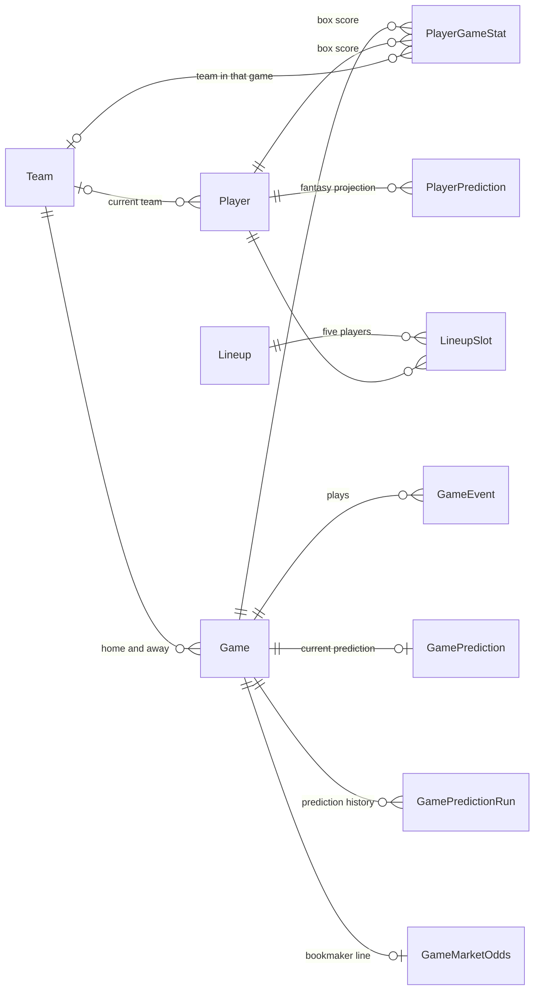
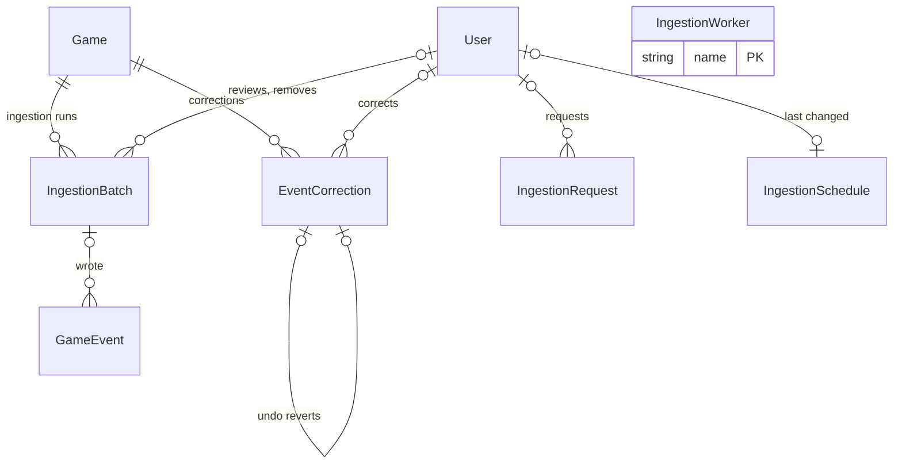
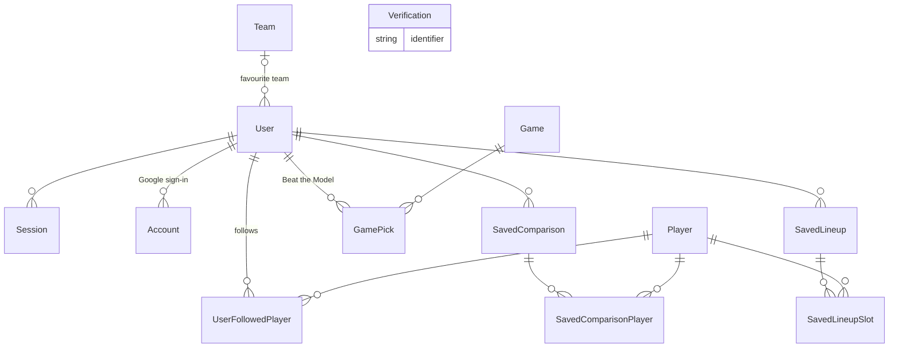
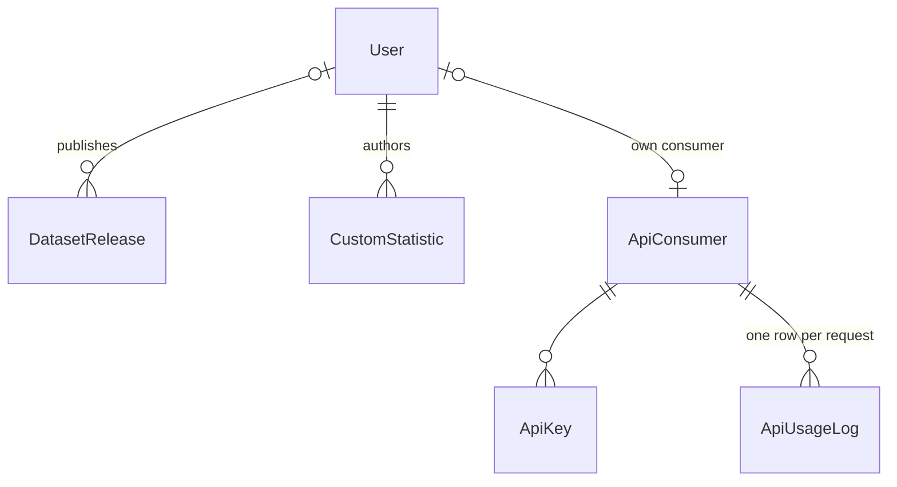
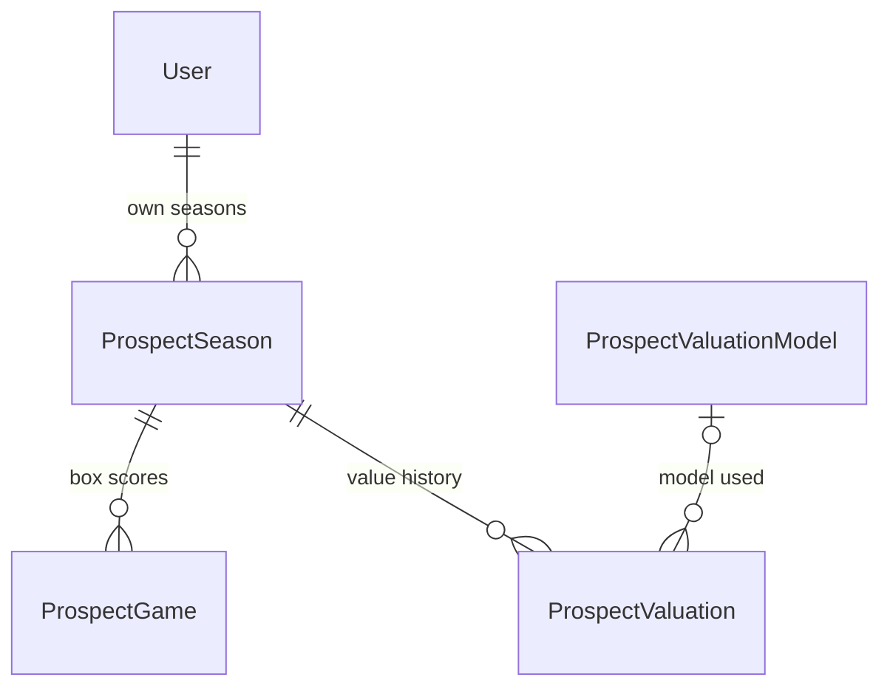

# ERD

The platform's PostgreSQL database (Supabase), managed with Prisma. The schema has **39 tables and 7 enums**; the newest migration is `20260923000000_add_become_pro`. Every table and constraint here was checked against `apps/api/prisma/schema.prisma` on 28 September 2026.

Why the database is designed this way: [ADR-001: Database](../decisions/adr-001-database.md). Where it runs: [ADR-003](../decisions/adr-003-hosting-topology.md). Why play-by-play is stored for one season only: [ADR-005](../decisions/adr-005-play-by-play-storage.md).

Unless stated otherwise, each table's primary key is `id`, a generated UUID. In the diagrams, `||` means exactly one, `o|` zero or one, and `o{` zero or many.

| Group | Tables | Written by |
|---|---|---|
| [NBA data and models](#nba-data-and-models) | 11 | Ingestion (`apps/ingestion`), predictor and optimizer scripts. The API writes NBA data only through admin corrections. |
| [Ingestion and review](#ingestion-and-review) | 5 | Ingestion scripts and the pull worker; the API for reviews, corrections and the schedule |
| [Accounts and personal data](#accounts-and-personal-data) | 10 | BetterAuth, and the API when a user saves something |
| [Publishing and API access](#publishing-and-api-access) | 5 | The API |
| [Become Pro](#become-pro) | 4 | The API; `apps/valuation` writes the trained model |

## NBA data and models

| Table | One row is | Key columns and constraints |
|---|---|---|
| `Team` | An NBA team | `nbaTeamId` unique; name, abbreviation, city, conference, division |
| `Player` | A player | `nbaPlayerId` unique; `teamId` is the **current** team; bio and draft fields from `CommonPlayerInfo` |
| `Game` | A game | `nbaGameId` unique; `homeTeamId`, `awayTeamId`, scores (empty until played); `seasonType` (`REGULAR`, `PLAY_IN`, `PLAYOFFS`, `FINALS`) and `playoffRound` |
| `GameEvent` | One play from `PlayByPlayV3` | Unique `(gameId, sequence)`; period, clock, `eventType`, `subType`, player, team, `success`, `value`, `batchId`. Validated against the event schema before it is stored. 2025-26 only ([ADR-005](../decisions/adr-005-play-by-play-storage.md)). |
| `PlayerGameStat` | One player's box score for one game | Unique `(playerId, gameId)`; `teamId` is the team **in that game**; counting stats, shooting splits, rebound split, plus-minus, usage, offensive and defensive rating |
| `GamePrediction` | The current prediction for a game | `gameId` unique; Elo win probability, each team's pre-game Elo, Four Factors margin, `modelVersion` |
| `GamePredictionRun` | One prediction per game per model version | Unique `(gameId, modelVersion)`, so older predictions survive a model change |
| `GameMarketOdds` | The bookmaker line from The Odds API | `gameId` unique; vig-free home win probability averaged across bookmakers, `bookmakerCount`, `fetchedAt` |
| `PlayerPrediction` | A player's projected fantasy points | `(playerId, asOf)` index; the newest row is used |
| `Lineup` | One optimizer run's best lineup | Total points, total salary, budget |
| `LineupSlot` | One player in a `Lineup` | Unique `(lineupId, playerId)` |

**Where the statistics come from.** Averages, TS%, eFG% and AST/TO are calculated from `PlayerGameStat` on each request; no averages are stored. For 2025-26, the counting stats in `PlayerGameStat` are derived from `GameEvent` rows (`derive_player_game_stats.py`); minutes and plus-minus come from the official box score. Earlier seasons have no play-by-play, so their rows come from the box score and have no rebound split or plus-minus. An empty optional stat means "not recorded" and shows as "—".

## Ingestion and review

| Table | One row is | Key columns and constraints |
|---|---|---|
| `IngestionBatch` | One ingestion run for one game | `status` (`RUNNING`, `COMPLETED`, `FAILED`, `PENDING_REVIEW`, `REJECTED`); accepted and rejected counts, `rejectionSummary` by reason; `resumeAfterSequence` checkpoint; reviewer and soft-delete fields |
| `EventCorrection` | One admin change to one play | Old and new values (changed fields only), who, why and when; `revertsCorrectionId` unique, so a correction can be undone once. Append-only. |
| `IngestionRequest` | A pull queued for the pull worker | `status`, season and date range, `scheduled`, who requested and which worker claimed it |
| `IngestionWorker` | A pull worker | Primary key `name`; `lastSeenAt`, so the admin page can tell whether a worker is running |
| `IngestionSchedule` | The automatic pull frequency | A single row with id `singleton`; `frequency` (`NEVER`, `HOURLY`, `DAILY`, `WEEKLY`), `lastRunAt` |

**Review gates publication.** A game is hidden from every public read while any of its batches is `PENDING_REVIEW`, `RUNNING`, `FAILED` or `REJECTED` (`PUBLISHED_GAME_FILTER`). A correction re-derives the affected players' `PlayerGameStat` rows and marks that season's dataset releases stale, in one transaction. See [Data Ingestion](ingestion.md).

## Accounts and personal data

`User`, `Session`, `Account` and `Verification` follow [BetterAuth's schema](https://better-auth.com/docs/concepts/database) ([ADR-002](../decisions/adr-002-auth.md)).

| Table | One row is | Key columns and constraints |
|---|---|---|
| `User` | A user | `email` unique; `role` (`PUBLIC`, `USER`, `ANALYST`, `ADMIN`), which sign-up can't change; `username` unique; `avatarUrl` (a private storage path); `favoriteTeamId` |
| `Session` | A signed-in browser session | `token` unique, `expiresAt` |
| `Account` | A linked sign-in method | Provider and its tokens. Google is the only provider. |
| `Verification` | A short-lived code | Required by BetterAuth; unused while Google is the only sign-in |
| `UserFollowedPlayer` | A followed player | No `id`; unique `(userId, playerId)` |
| `GamePick` | A user's call on a finished game | Unique `(userId, gameId)`, so a call is final; `outcome` (`CORRECT`, `MISSED`); a copy of the model's figures at the time of the call |
| `SavedComparison` | A named comparison | Name and owner |
| `SavedComparisonPlayer` | One player in it | Unique `(savedComparisonId, playerId)`; `position` is the left-to-right order |
| `SavedLineup` | A lineup the user kept | Name; totals copied at save time |
| `SavedLineupSlot` | One player in it | Unique `(savedLineupId, playerId)`; points and salary copied at save time |

`GamePick` and the saved lineups copy model figures on purpose: predictions are replaced on every run, and a user's record must not change afterwards. Every `/v1/me/*` query is scoped to the session user.

## Publishing and API access

| Table | One row is | Key columns and constraints |
|---|---|---|
| `DatasetRelease` | A versioned season snapshot | `version` unique (for example `2025-26.1`); SHA-256 `checksum`; row counts; `fieldSchema`; `isStale` after a correction; the exact `csv` as published |
| `CustomStatistic` | An analyst's formula | Unique `(authorId, name)`; `expression` checked by the API's own parser, never `eval`; `version` goes up on each edit |
| `ApiConsumer` | A key holder | `rateLimit` per minute and `dailyQuota`; `userId` unique and set for a user's own consumer, empty for an external one |
| `ApiKey` | A key | `keyHash` unique (SHA-256). The key itself is shown once and never stored. |
| `ApiUsageLog` | One request made with a key | `(consumerId, calledAt)` index, used to enforce the limits. Nothing prunes it yet. |

## Become Pro

Private to their owner. See [Become Pro](../become-pro/index.md).

| Table | One row is | Key columns and constraints |
|---|---|---|
| `ProspectSeason` | One league year for one user | Unique `(userId, season)`; `competitionLevel` (`NCAA_D1` to `REC`), position, team |
| `ProspectGame` | A self-reported box score | Unique `(seasonId, gameDate, opponent)`; the `PlayerGameStat` columns a player can know about their own game |
| `ProspectValuation` | A season's projected value | Draft slot, value and range in USD, rookie-scale year, level factor, drivers, NBA comparables, `modelId`. A row is added only when a figure changes. |
| `ProspectValuationModel` | A trained draft-slot model | `bundle` (coefficients, rookie scale, level factors), training rows, MAE, rank correlation. The API applies the newest one. |

## Enums

| Enum | Values |
|---|---|
| `Role` | `PUBLIC`, `USER`, `ANALYST`, `ADMIN` |
| `SeasonType` | `REGULAR`, `PLAY_IN`, `PLAYOFFS`, `FINALS` |
| `PickOutcome` | `CORRECT`, `MISSED` |
| `IngestionBatchStatus` | `RUNNING`, `COMPLETED`, `FAILED`, `PENDING_REVIEW`, `REJECTED` |
| `IngestionRequestStatus` | `QUEUED`, `RUNNING`, `SUCCEEDED`, `FAILED`, `CANCELLED` |
| `IngestionFrequency` | `NEVER`, `HOURLY`, `DAILY`, `WEEKLY` |
| `CompetitionLevel` | `NCAA_D1`, `NCAA_D2`, `NCAA_D3`, `NAIA`, `JUCO`, `INTERNATIONAL_PRO`, `SEMI_PRO`, `HIGH_SCHOOL`, `REC` |

## What happens on delete

| Deleting | Effect |
|---|---|
| A user | Their sessions, accounts, follows, picks, saved items, Become Pro seasons, custom statistics and own API consumer are deleted. Records of admin work they did are kept with the link cleared. |
| A player or game that statistics, plays, predictions, odds, batches or corrections depend on, or a team that games refer to | Refused, so derived records never lose their source |
| A player or game with only user data pointing at it | Users' follows, picks and saved items for it are deleted |
| A team | Users with it as their favourite are left without one |
| An API consumer | Its keys and usage log are deleted |
| A Become Pro season | Its games and valuations are deleted |
| A valuation model | Valuations keep their figures; only the link is cleared |
| An ingestion batch or a correction | Plays and undos keep their data; only the link is cleared. Batches are soft-deleted in normal use. |

Five indexes for the common queries (`Game` by date and by team, `PlayerGameStat.gameId`, `Player.teamId`) were added in PR #124. [Performance](performance.md) has the measured effect.

## Player archetypes

Four tables from migration `20260922200000_add_player_archetypes`: `Archetype`, `PlayerArchetype`, `PlayerArchetypeMembership` and `PlayerSimilarity`. They are written only by `apps/similarity` and read by three API routes; [Player Archetypes](../player-archetypes/index.md#how-it-works) describes what they hold.

## Open issues

- **Next season's play-by-play** won't fit beside 2025-26's within the 500 MB limit. A decision is needed before it is loaded ([ADR-005](../decisions/adr-005-play-by-play-storage.md#the-next-season)).
- **One automated submitter.** Ingestion is the only source of submissions, so there is no multi-person approval flow. This is deliberate.

## Known differences between the schema and the database

The database has an index on `IngestionBatch.reviewedById` and a default on `IngestionSchedule.updatedAt` that `schema.prisma` doesn't declare. Both are harmless. The next `prisma migrate dev` will try to drop them; remove those lines from the generated migration unless the change is intended.

The [original column diagram](diagrams/database-erd.svg) (20 tables) was drawn before Sprint 3 and is kept for the record; its source is `docs/diagrams/database-erd.puml` in the app repository.

---

*AI Declaration: The preceding document was generated with the assistance of the following: Claude-Web[Claude Sonnet 5], Claude-Code[Claude Opus 5], Claude-Code[Claude Sonnet 5], Claude-Code[Claude Opus 5.5]*
