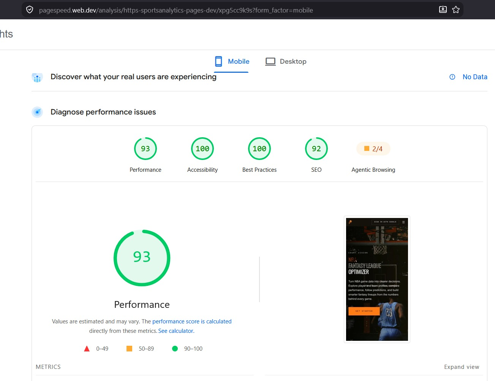
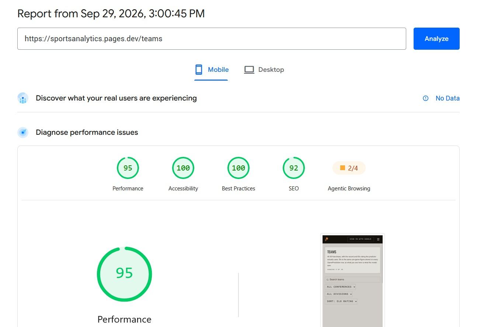
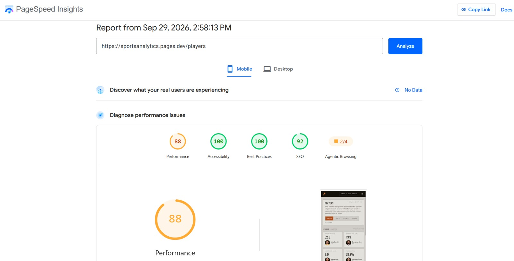
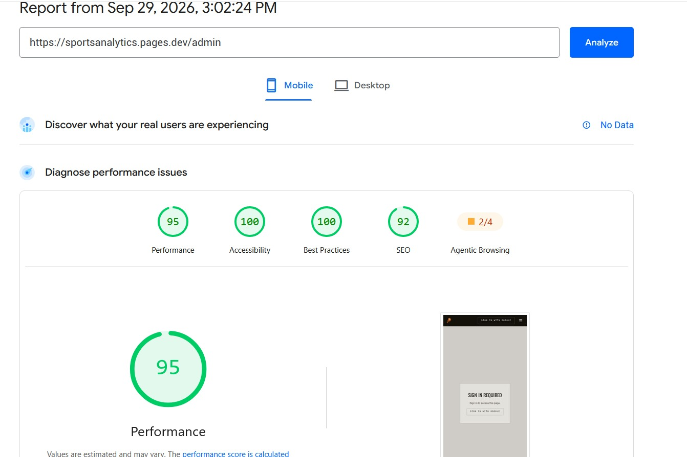

# Performance

How fast the live app is, and how the API keeps database work down. Most of the API work was one optimisation pass (PR #124, 13 Sep).

| Evidence | Result |
|---|---|
| [Lighthouse](#lighthouse-scores-2026-09-29), mobile, 29 Sep | Performance **88–95**, Accessibility **100** on Home, Teams, Players and Admin |
| [Query counts](#measured-result) | Most public routes issue **0** data queries on a repeat request |
| [Production timings](#production-timings-8-oct), 8 Oct | Public data reads took **2.6–4.7 s**, against a 300 ms target, because of the API-key check |

## Lighthouse scores (2026-09-29)

Google PageSpeed Insights, mobile, against the live site:

| Page | Performance | Accessibility | Best Practices | SEO |
|---|---|---|---|---|
| [Home](https://sportsanalytics.pages.dev/) | 93 | 100 | 100 | 92 |
| [Teams](https://sportsanalytics.pages.dev/teams) | 95 | 100 | 100 | 92 |
| [Players](https://sportsanalytics.pages.dev/players) | 88 | 100 | 100 | 92 |
| [Admin](https://sportsanalytics.pages.dev/admin) | 95 | 100 | 100 | 92 |

Admin was measured signed out, so it shows only the sign-in prompt.

## Why caching is safe here

The API is one Render free-plan instance talking to Supabase through a connection pooler, so every database round trip is slow. The NBA data changes only when the Python jobs run, so between runs the same query gives the same answer, and a short cache lifetime costs nothing in correctness. User data changes constantly, and it is never cached.

## What the audit found

Before PR #124, nothing was cached. Every page view, tab switch and signed-in request reached Postgres.

| Problem | Detail |
|---|---|
| Frontend refetching | React Query's defaults re-ran all 41 queries on every mount and tab switch. |
| Session lookups | Every signed-in request re-read the `Session` and `User` tables. |
| Heavy public reads | `/players/leaders` grouped about 80,000 box-score rows per request; both analytics routes scanned every completed game. |
| Redundant queries | `/players/:id/stats/splits` ran four queries where one would do; `/players/compare` ran two per player. |
| Missing indexes | `Game` was indexed only on `seasonType`, not on the date and team columns most queries use. |

## The fixes

### Response cache

A small in-memory cache in `apps/api/src/cache/`, with no new dependencies ([ADR-004](../decisions/adr-004-caching-strategy.md)).

- **Single-flight:** identical requests arriving together share one query.
- **Errors and not-found results are never stored,** so a passing database error doesn't stick.
- **At most about 500 entries,** oldest evicted first, to fit a 512 MB instance.
- **Off under tests** and with `API_CACHE_DISABLED=true`.

| Lifetime | Covers |
|---|---|
| 1 hour | Teams and seasons |
| 5 minutes | Stats, games, predictions, Elo ratings, lineups |
| 60 seconds | Leaderboard counts; the current Become Pro model |

### What is cached, and what deliberately is not

Only public reads that are the same for everyone are cached. **Nothing under `/v1/me` is cached:** it is per-user, changes often, and caching anything keyed on a session is the easiest way to show one user another's data. Become Pro caches only the shared trained model, never a user's seasons.

Caching sits in the services, not the controllers, so a shared intermediate result is cached once and reused (sorted player lists reuse the leaders data). A new pick clears the leaderboard at once.

### Query consolidation

These savings hold even when the cache is empty.

| Route | Queries before | After |
|---|---|---|
| `GET /v1/players/:id/stats` | 3 | 2 |
| `GET /v1/players/:id/stats/splits` | 5 | 2 |
| `GET /v1/players/compare` (4 players) | 8 | 2 |
| `GET /v1/games/:id/prediction` | 2 | 1 |
| Leaderboard counts | 3 | 2 |

### Frontend caching

React Query keeps data fresh for **5 minutes**, matching the API, and no longer refetches on tab focus. Every user action still invalidates its queries, so follows, picks and saved lineups show at once.

### Sessions

BetterAuth trusts a signed session cookie for 5 minutes instead of reading the database on every request. The cost: a revoked session can last up to 5 minutes ([Security](../security.md#session-cookie-cache)).

### Indexes

Migration `add_query_indexes` (13 Sep) adds `Game(gameDate)`, `Game(homeTeamId, gameDate)`, `Game(awayTeamId, gameDate)`, `PlayerGameStat(gameId)` and `Player(teamId)`.

## Measured result

SQL statements per request against a local database with real data: first call, then an immediate repeat.

| Route | First | Repeat |
|---|---|---|
| `GET /v1/games?status=completed` | 6 | 0 |
| `GET /v1/games/seasons` | 1 | 0 |
| `GET /v1/teams/elo-ratings` | 6 | 0 |
| `GET /v1/players/leaders` | 3 | 0 |
| `GET /v1/players?sort=ppg` | 0 | 0 |
| `GET /v1/analytics/model-accuracy` | 2 | 0 |
| `GET /v1/analytics/leaderboard` | 1 | 0 |
| `GET /v1/players/:id/stats` | 1 | 0 |
| `GET /v1/players/:id/stats/splits` | 3 | 1 |

A sorted player list costs nothing even on its first call because it reuses the leaders data. Splits is consolidated but deliberately uncached, so it still runs one statement. These are statement counts from a local database, not production timings.

They also leave out the API-key check. These counts were taken before API keys were required (17 Sep). Since then every signed-out request carries the site proxy's key, and the check that validates it ran three queries (the key lookup, then the last minute's and today's usage counts) plus a usage-log write on every request, before any cached read was served.

## Production timings (8 Oct)

Repeat requests per route from Johannesburg, through the site's own proxy, leaving out each route's first (cold) request:

| Route | Response time |
|---|---|
| `GET /v1/health` (no key check, no database) | 0.49–0.55 s |
| `GET /v1/teams` | 2.6–2.8 s |
| `GET /v1/games?pageSize=25` | 2.6–2.8 s |
| `GET /v1/players/:id/stats` | 2.7–2.8 s |
| `GET /v1/players?pageSize=25` | 3.6–4.3 s |
| `GET /v1/games/:id/events?pageSize=200` | 4.3–4.7 s |

The health route shows that the network and the proxy account for about half a second. The other two seconds or more come from the API-key check's database round trips through the Supabase pooler, which run before the response cache is consulted. The fix ([PR #204](https://sdp.ms.wits.ac.za/innovation/sportsanalytics/pulls/204), in review) keeps resolved keys and rate-limit counts in memory and batches the usage-log writes, so a cached read touches the database not at all.

## The staleness contract

The price of the caching:

- Public NBA data can be **up to 5 minutes old** after a data job runs (1 hour for teams and seasons).
- A **revoked session** can last up to 5 minutes; sign-out and account deletion are immediate.
- **Nothing a user owns is ever stale.**
- A **newly trained valuation model** reaches the API within 60 seconds.

## Measuring it yourself

Set `PRISMA_LOG_QUERIES=true` to log every SQL statement, and `API_CACHE_DISABLED=true` to turn the cache off. Load Home, Predictions, Players and a player profile, then repeat: the second visit should log no queries for public data.

---

*AI Declaration: The preceding document was generated with the assistance of the following: Claude-Code[Claude Opus 5], Claude-Code[Claude Opus 5.5]*
