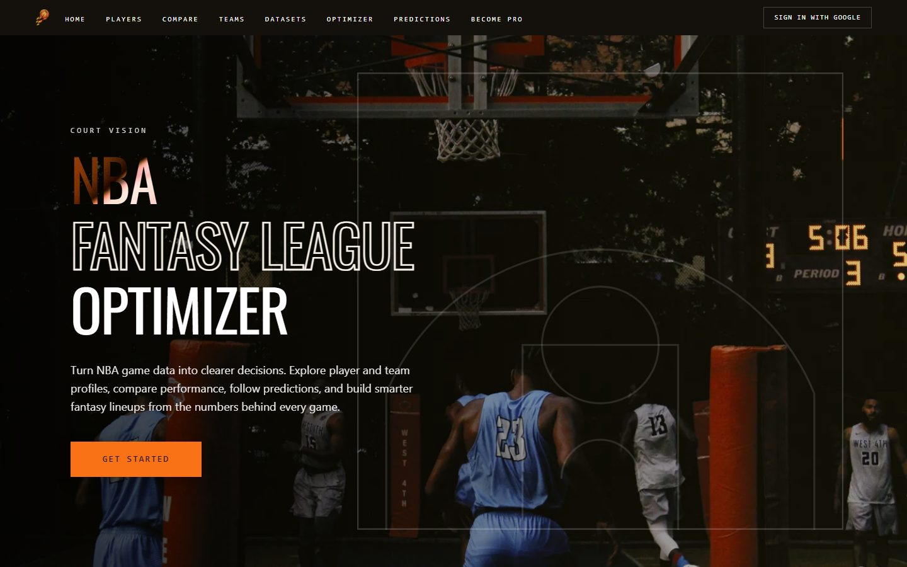
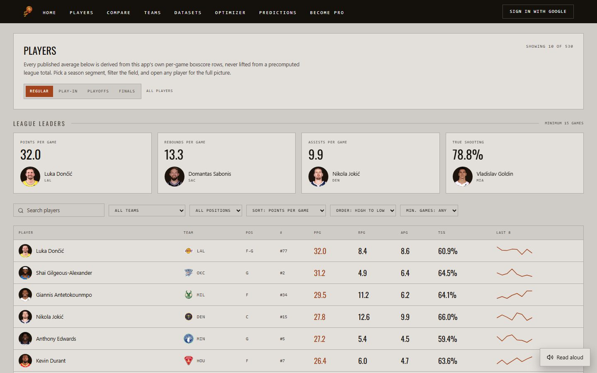
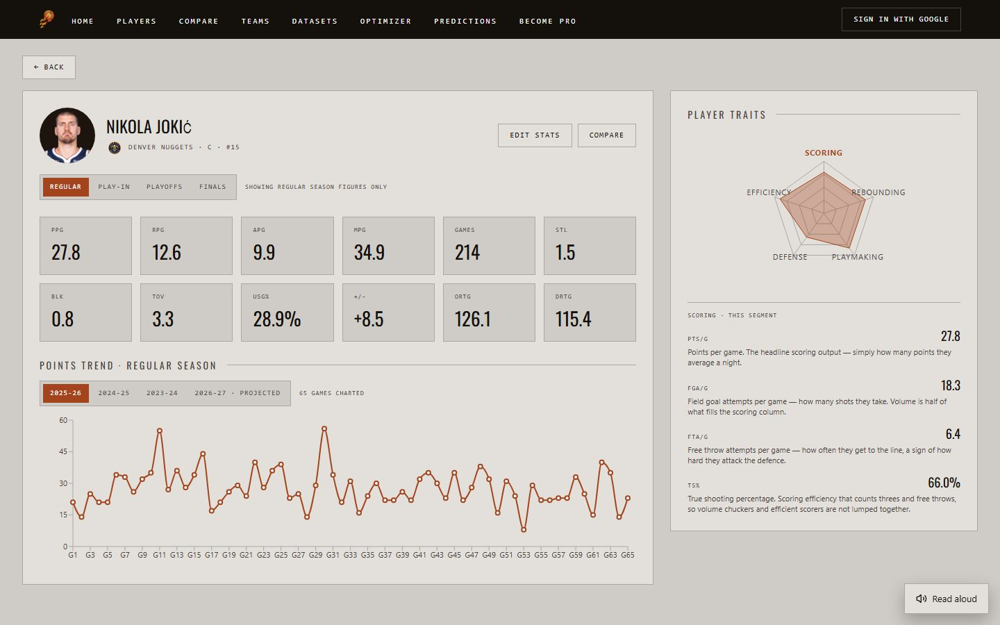
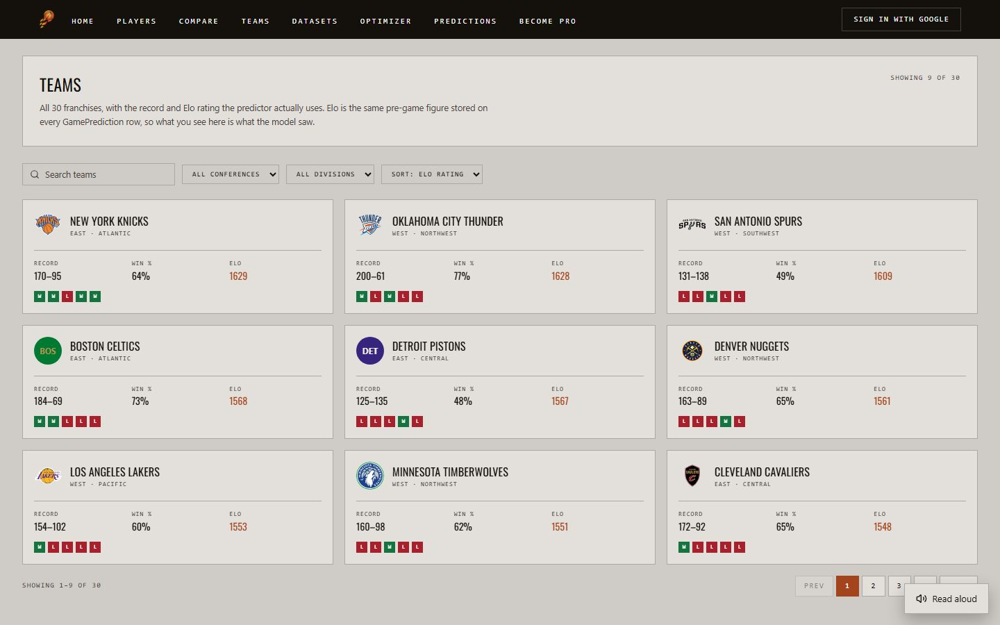
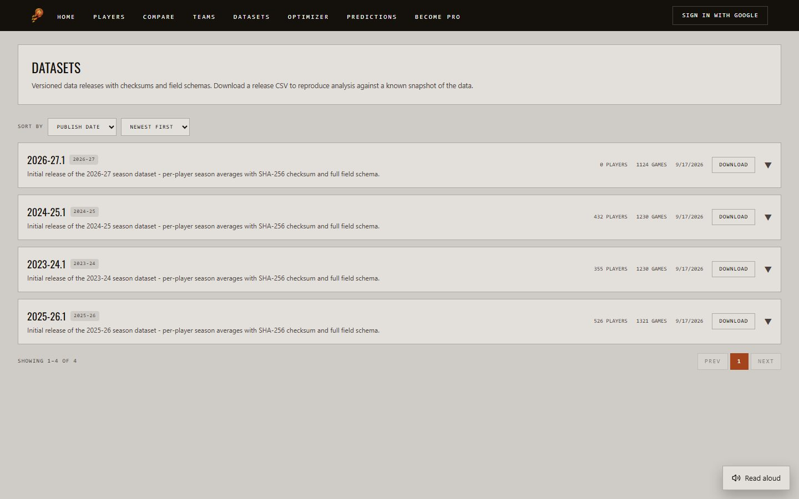
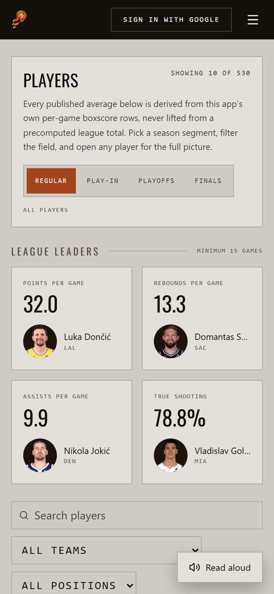
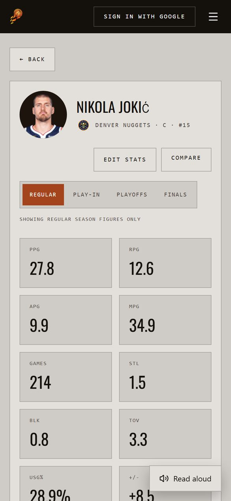

# UI Overview

The web app as it stands at submission. The team skipped low-fidelity wireframes: it worked from reference dashboards and built the React pages directly, so this page documents the build itself. Screenshots were taken from the live site on 2026-10-03.

## Navigation

One header (`LandingHeader`) on every page:

- Links: **Home**, **Players**, **Compare**, **Teams**, **Datasets**, **Optimizer**, **Predictions** and **Become Pro**, plus **Admin** for an admin.
- Sign in or out on the right.
- Below the `xl` breakpoint the links move into a drawer behind a menu button.
- A skip-to-content link comes first in the tab order.
- A **Read aloud** button, bottom right, reads the page with the browser's speech synthesis.

## Pages

| Route | Access | What it shows | Main endpoints |
|---|---|---|---|
| `/` | Public | Landing: what the product does, how predictions work, developer credits, and Get Started | — |
| `/players` | Public | League leaders, then a sortable, filterable table with a last-8-games sparkline per player | `GET /v1/players`, `/v1/players/leaders` |
| `/players/:playerId` | Public | 12 stat tiles, points trend by season with a projected next season, traits radar with stat definitions, Edit Stats ("what-if", never saved), Follow, Compare | `GET /v1/players/{id}`, `/stats`, `/stats/splits`, `/stats/career` |
| `/compare` | Public | Up to four players side by side for one season segment | `GET /v1/players/compare` |
| `/teams` | Public | A card per team: record, win %, Elo and last five results. Filter by conference or division, sort by Elo. | `GET /v1/teams`, `/v1/teams/records` |
| `/teams/:teamId` | Public | Record, win %, Elo and roster | `GET /v1/teams/{id}` |
| `/datasets` | Public | Versioned releases with schema, CSV download and a checksum check | `GET /v1/datasets`, `/{version}/download` |
| `/home` | Signed in | Dashboard (see below) | `/v1/me/*`, `/v1/analytics/*` |
| `/predictions` | Signed in | Games with Elo win probability and Four Factors margin | `GET /v1/games` |
| `/games/:gameId` | Signed in | Prediction, bookmaker probability from The Odds API, and predicted top scorers on a court view | `GET /v1/games/{id}` |
| `/optimizer` | Signed in | The latest MILP fantasy lineup under a salary cap, with projected points per slot. It can be saved. | `GET /v1/optimizer/lineup`, `POST /v1/me/lineups` |
| `/become-pro` | Signed in, private | The user's own seasons, games, derived line, projected pick and value, and NBA comparables | `GET /v1/me/become-pro` |
| `/profile` | Signed in | Favourite team, followed players, avatar, API keys with usage, Become Pro card, account deletion. `/api-keys` redirects here. | `GET /v1/me`, `/v1/me/api-keys` |
| `/onboarding` | Signed in | First run: pick a username, a favourite team and players to follow | `PATCH /v1/me` |
| `/admin` | Admin | Batch review, event corrections, ingestion schedule, API consumers, reference data and users | `/v1/admin/*` |

The [API Reference](../api-reference.md) lists every endpoint.

### Players

Every figure is derived from the app's own box-score rows. The **Regular / Play-In / Playoffs / Finals** control switches the page to that part of the season.

### Player profile

The radar puts five traits (Scoring, Rebounding, Playmaking, Defense, Efficiency) on one 0–100 scale. Clicking a trait lists the stats behind it in plain English, which came from user feedback ([F7](../improvements.md)).

### Teams

The Elo shown is the same pre-game rating stored on each prediction, so it is what the model saw.

### Datasets

### Home (signed in)

The dashboard is built around one idea: **an account has to be necessary, not decorative**. The NBA data is the same for everyone; what you follow and how well you call games is yours.

| Section | What it shows |
|---|---|
| **Beat the Model** | A finished game with the score hidden. Call it, then see the result beside the model's call. |
| **Watchlist** | Followed players with their averages, recent scoring and your own scouting note |
| **Your Teams** | Recent results for your teams, shown from your team's side |
| **Model accuracy** | The model's hit rate against an always-pick-home baseline, its Brier score and calibration |
| **Leaderboard** | Users ranked by hit rate, with the model as a benchmark row |
| **Saved** | Saved comparisons and lineups |
| **Become Pro** | Your projected pick and value, or an invitation to start a season |

## Visual design

Colours are Tailwind `@theme` custom properties in `index.css`. Charts (Recharts) use the same variables, so they follow the theme.

The "locker" palette is a light, warm grey with a leather accent. It was introduced on the landing page and now covers every page, so signing in feels like going further into the same building rather than into another product.

| Token | Value | Use |
|---|---|---|
| `--color-locker-surface` | `#e3e0dc` | Page and card background |
| `--color-locker-leather` | `#a4441c` | Accent and active state. 4.66:1 contrast on the surface, so it is safe for small text. |
| `--color-locker-ink-muted` | `#4a423b` | Secondary text |
| `--color-locker-you` / `-model` | `#c2410c` / `#1f6f9c` | Your pick against the model's, checked as a colour-blind-safe pair |
| `--color-locker-good` / `-bad` | `#15733f` / `#a8202c` | Outcomes. Always shown with a glyph and a word, never colour alone. |

The header stays dark (`--color-landing-ink`, `#14100c`) with the orange `#f97316` accent from the original palette.

## Responsive design

Layouts are mobile-first Tailwind with `sm`, `md`, `lg` and `xl` breakpoints. On a phone, tables keep their key columns and the navbar becomes a menu. The pages were checked at 390 px wide with no horizontal scrolling.

{ width="300" }

{ width="300" }

## Accessibility

- **Lighthouse Accessibility 100** on Home, Teams, Players and Admin (mobile, 2026-09-29). See [Performance](performance.md).
- `axe-core` checks run in the component tests (`src/test/accessibility.ts`) for Players, Home, Optimizer and Predictions.
- Skip-to-content link, with `tabIndex={-1}` on `<main>` so focus lands there.
- Labelled navigation, with visible focus states.
- Text contrast is measured, and colour is never the only signal.
- Read aloud on every page.

---

*AI Declaration: The preceding document was generated with the assistance of the following: Claude-Web[Claude Sonnet 5], Claude-Code[Claude Opus 5], Claude-Code[Claude Sonnet 5], Claude-Code[Claude Opus 5.5]*
