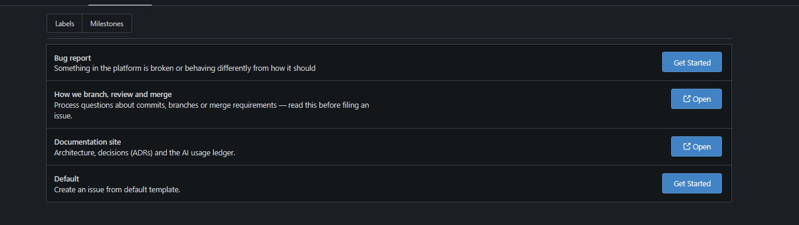

# Testing

This page describes what testing exists across the project, how it runs, the tooling behind it, and the team's test policy — what must be tested, at what level, and before what it must pass. It covers automated testing (unit, integration, end-to-end, and component), the CI test pipeline, coverage reporting, and the user feedback process.

## Testing strategy

The project uses a **three-layer** testing approach, each layer targeting a different failure mode:

| Layer | What it catches | Where it lives | Tooling |
|---|---|---|---|
| **Unit tests** | Logic bugs in individual services, utilities, and pure functions | `src/**/*.spec.ts` alongside source files | Vitest |
| **Integration / E2E tests** | Broken API routes, database query errors, auth guard failures, incorrect HTTP status codes | `apps/api/test/**/*.e2e-spec.ts` | Vitest + Supertest + real Postgres |
| **Component tests** | UI rendering bugs, broken user interactions, missing accessibility attributes | `src/**/*.spec.{ts,tsx}` alongside components | Vitest + React Testing Library + jsdom |

The principle: **unit tests for logic, integration tests for routes, component tests for UI** — with no layer doing another's job. A unit test never boots the database; an E2E test never imports a React component.

As of PR #124 (13 September 2026) the API suite is **414 tests** and passes in full, end-to-end specs included. The web home-page suite passes alongside it, with cases added for the Beat the Model loading state, the early load of the next game, and skipping a game that was already called.

## API tests

### Unit tests

Unit specs live next to the source files they exercise (`src/**/*.spec.ts`) and test individual services and utilities in isolation. They do **not** start a Nest application, connect to a database, or make HTTP requests.

!!! note "Table rebuilt 2026-09-23 — was listing 27 of 52 unit spec files"
    A week's worth of admin/dataset/custom-statistics work had no corresponding row here. Regenerated directly from `find src -name "*.spec.ts"`.

| Spec file | What it tests |
|---|---|
| `src/admin/admin-batches.controller.spec.ts` | Admin batch review controller (approve/reject request handling) |
| `src/admin/admin-batches.service.spec.ts` | Batch listing filters/sort, approve/reject status transitions |
| `src/admin/admin-consumers.service.spec.ts` / `.mock.spec.ts` | External API consumer + key issuance, revoke, hard-delete |
| `src/admin/admin-events.service.mock.spec.ts` | Event-correction preview/apply/undo, validation, supersede-protection on undo |
| `src/admin/admin-ingestion.service.spec.ts` | Manual/scheduled ingestion pull queueing |
| `src/admin/admin-players.controller.spec.ts` | Admin player management endpoints |
| `src/admin/admin-players.service.spec.ts` | Admin player service logic |
| `src/admin/admin-teams.controller.spec.ts` | Admin team management endpoints |
| `src/admin/admin-teams.service.spec.ts` | Admin team service logic |
| `src/admin/admin-users.controller.spec.ts` | Admin user management endpoints |
| `src/admin/admin-users.service.spec.ts` | Admin user service logic |
| `src/admin/derive-player-game-stats.spec.ts` | Event-to-PlayerGameStat aggregation math |
| `src/admin/event-correction-request.spec.ts` | Correction request parsing/validation |
| `src/admin/event-correction-rules.spec.ts` | Which corrections are allowed (e.g. rejects a credit landing on the wrong player) |
| `src/admin/plan-stat-recompute.spec.ts` | Incremental recompute — only the affected player(s), never the whole roster |
| `src/admin/stat-anomalies.spec.ts` | Internal-consistency anomaly flags (negative stats, impossible shooting splits) |
| `src/analytics/evaluated-games.service.spec.ts` | Games evaluated for model accuracy |
| `src/analytics/leaderboard-ranking.spec.ts` | Leaderboard ranking computation |
| `src/analytics/leaderboard.service.spec.ts` | Leaderboard service logic |
| `src/analytics/model-accuracy.service.spec.ts` | Model accuracy computation (Brier score, calibration bands) |
| `src/cache/response-cache.service.spec.ts` | Response cache service |
| `src/common/all-exceptions.filter.spec.ts` | The global exception filter maps errors to correct HTTP status codes |
| `src/common/api-key.guard.spec.ts` | API key auth, rate limit, and daily quota enforcement |
| `src/common/api-keys.spec.ts` | Key generation/hashing |
| `src/common/api-version.guard.spec.ts` | `/v1/` version enforcement, `Accept-Version` negotiation |
| `src/common/csv.spec.ts` | CSV export escaping/formatting |
| `src/common/deprecation.interceptor.spec.ts` | `Deprecation`/`Sunset`/`Link` headers on a deprecated route |
| `src/common/optional-session.guard.spec.ts` | Session-or-API-key gate on public read controllers |
| `src/common/origin-check.guard.spec.ts` | Origin check guard for CSRF protection |
| `src/common/pagination.spec.ts` | Pagination helper produces correct offsets and page counts |
| `src/common/parse-body.spec.ts` | Zod-based request body parser |
| `src/common/roles.guard.spec.ts` | Role-based guard allows/denies access correctly |
| `src/custom-statistics/custom-statistics.controller.spec.ts` / `.service.spec.ts` | Custom statistic CRUD and per-player calculation |
| `src/custom-statistics/expression-evaluator.spec.ts` | Hand-rolled expression parser (no `eval`), division-by-zero rejection |
| `src/custom-statistics/expression-validator.spec.ts` | Whitelisted-identifier validation before a definition is stored |
| `src/datasets/datasets.controller.spec.ts` / `.service.spec.ts` | Dataset release listing, publish, checksum, diff/changes-since |
| `src/games/games.service.spec.ts` | Games service logic |
| `src/me/api-keys/me-api-keys.controller.spec.ts` / `.service.spec.ts` | Self-service API key issuance/listing/revoke |
| `src/me/follows/game-orientation.spec.ts` | Team results oriented to the caller's side |
| `src/me/follows/recent-points.spec.ts` | Recent points computation for watchlist |
| `src/me/follows/watchlist-averages.spec.ts` | Watchlist season averages derivation |
| `src/me/me.controller.spec.ts` | User profile controller |
| `src/me/me.service.spec.ts` | User profile service logic |
| `src/me/picks/pick-grading.spec.ts` | Pick grading (CORRECT/MISSED against model and real result) |
| `src/me/picks/pick-serializers.spec.ts` | Allow-list serializers for pick responses (score withholding) |
| `src/me/saved-lineups.controller.spec.ts` | Saved lineups controller |
| `src/me/saved-lineups.service.spec.ts` | Saved lineups service with drift computation |
| `src/players/stats.service.spec.ts` | Player stats service computes derived statistics |
| `src/teams/teams.service.spec.ts` | Teams service logic |

### End-to-end tests

E2E specs live in `apps/api/test/` and exercise the **full NestJS application** — real routing, real middleware, real exception filter, real Prisma queries against a disposable Postgres database. They use [Supertest](https://github.com/ladjs/supertest) to make HTTP requests against the running test app.

!!! note "Table rebuilt 2026-09-23 — was listing 9 of 17 e2e spec files"

| Spec file | What it tests |
|---|---|
| `test/admin-anomalies.e2e-spec.ts` | Admin anomaly-flag listing against real seeded rows |
| `test/admin-auth.e2e-spec.ts` | `/v1/admin/*` genuinely rejects a non-admin session/no session |
| `test/admin-batches-ordering.e2e-spec.ts` | Batch list orders through the `Game` relation correctly (a bug a mocked Prisma client couldn't have caught) |
| `test/admin-events.e2e-spec.ts` | The full event-correction workflow against a real database — preview, apply, undo, validation, history |
| `test/admin-games.e2e-spec.ts` | Admin game lookup + play-by-play with resolved credit |
| `test/admin-ingestion-queue.e2e-spec.ts` | Ingestion pull request queue/claim/finish lifecycle |
| `test/analytics.e2e-spec.ts` | Analytics endpoints — model accuracy, leaderboard |
| `test/datasets.e2e-spec.ts` | Dataset release publish, download, checksum reproducibility, diff/changes-since |
| `test/games.e2e-spec.ts` | Game endpoints — list, detail, predictions, postseason filtering |
| `test/health.e2e-spec.ts` | `GET /health` returns 200 with `{ status: "ok" }` |
| `test/not-found.e2e-spec.ts` | Unknown routes return 404 via the `NotFoundController` catch-all |
| `test/openapi-contract.e2e-spec.ts` | The API's public surface hasn't silently changed shape versus its own generated OpenAPI document |
| `test/optimizer.e2e-spec.ts` | Optimizer endpoint — lineup generation, validation, predictions |
| `test/picks.e2e-spec.ts` | Beat the Model — challenge next game, submit pick, grade outcome, record |
| `test/players.e2e-spec.ts` | Player endpoints — list, detail, filtering, pagination, stats, splits, compare |
| `test/saved-lineups.e2e-spec.ts` | Saved lineups — create, list, delete, drift computation |
| `test/teams.e2e-spec.ts` | Team endpoints — list, detail, roster lookup |

### Test infrastructure

**`create-test-app.ts`** — Boots the real `AppModule` on an Express 5 adapter (matching the production `main.ts` setup exactly, including the `ExpressAdapter` to avoid Nest's bundled Express 4 fallback). Applies the global exception filter. Returns the `INestApplication` for Supertest to drive.

```typescript
// Simplified — see apps/api/test/create-test-app.ts for the full version
export async function createTestApp(): Promise<INestApplication> {
  const server = expressFactory();
  server.use(expressFactory.json());
  const app = await NestFactory.create(AppModule, new ExpressAdapter(server), { logger: false });
  app.useGlobalFilters(new AllExceptionFilter());
  await app.init();
  return app;
}
```

**`test-db.ts`** — A shared `PrismaClient` instance and a `resetDatabase()` helper that truncates all tables in foreign-key-safe order. Called from `afterEach` in every E2E spec so tests never depend on leftover state.

**`global-setup.ts`** — Runs `npx prisma migrate deploy` once before the entire test suite, applying all migrations to the disposable test database. Throws if `DATABASE_URL` is not set, forcing the developer to configure `.env.test` first.

### Database isolation

E2E tests run **serially** (`fileParallelism: false` in `vitest.config.ts`) against a single shared Postgres database. This is deliberate: parallel spec files would race each other's inserts and truncations, causing flaky unique-constraint failures. The 20-second `testTimeout` and `hookTimeout` accommodate the database round-trips.

The test database is **disposable** — it is created fresh in CI (a `postgres:16-alpine` service container) and pointed at locally via `.env.test` (copied from `.env.test.example`). No test data persists between runs.

!!! note "The API response cache disables itself under test"
    The in-process response cache added in PR #124 detects Vitest and passes straight through, rather than relying on every spec to remember to clear it. Without that, a suite that truncates and reseeds one shared database between specs would serve a previous spec's rows from cache. It can also be switched off explicitly with `API_CACHE_DISABLED=true` — see [Performance](design/performance.md).

## Frontend tests

### Component tests

Frontend specs live next to the components and pages they test (`src/**/*.spec.{ts,tsx}`) and use **React Testing Library** with the **jsdom** environment. The philosophy is to test components the way a user would interact with them — by role, label, and text content — rather than by implementation details like state or instance methods.

**Pages (16 specs):**

| Spec file | What it tests |
|---|---|
| `src/pages/AdminPage.spec.tsx` | Admin panel — user/player/team management |
| `src/pages/ComparePage.spec.tsx` | Player comparison with radar charts and trait tables |
| `src/pages/GameDetailPage.spec.tsx` | Game detail with prediction, scorers, events |
| `src/pages/HomePage.spec.tsx` | Signed-in home dashboard — Beat the Model, watchlist, teams |
| `src/pages/LandingPage.spec.tsx` | Landing page — hero, What We Do, Model Explainer, Stand Out |
| `src/pages/OnboardingPage.spec.tsx` | New user onboarding — username setup |
| `src/pages/OptimizerPage.spec.tsx` | Optimizer — lineup generation, saved lineups, salary cap |
| `src/pages/PlayerProfilePage.spec.tsx` | Player profile — stats, season splits, follow button |
| `src/pages/PlayersListPage.spec.tsx` | Players list — search, filters, postseason toggle, pagination |
| `src/pages/PredictionsPage.spec.tsx` | Predictions — model accuracy, calibration, leaderboard |
| `src/pages/ProfilePage.spec.tsx` | User profile — favorite team/followed players, API keys, account deletion. No password change: auth is Google OAuth only, there's no password on our side (see [Security](security.md)) |
| `src/pages/TeamProfilePage.spec.tsx` | Team profile with roster |
| `src/pages/TeamsListPage.spec.tsx` | Teams list with search and cards |

**Components (22 specs):**

| Spec file | What it tests |
|---|---|
| `src/components/AdminGate.spec.tsx` | Admin gate restricts access to admin users |
| `src/components/AuthStatus.spec.tsx` | Auth status displays login/logout state |
| `src/components/ComparisonTraitsRadar.spec.tsx` | Radar chart comparing player traits |
| `src/components/CourtView.spec.tsx` | Court visualization renders player positions |
| `src/components/ErrorState.spec.tsx` | Error state displays message and retry |
| `src/components/FollowPlayerButton.spec.tsx` | Follow/unfollow player toggle |
| `src/components/FollowTeamButton.spec.tsx` | Follow/unfollow team toggle |
| `src/components/Pagination.spec.tsx` | Pagination controls emit correct page changes |
| `src/components/PlayerCards.spec.tsx` | Player card rendering with headshot and team |
| `src/components/PlayerHeadshot.spec.tsx` | Player headshot image loads with fallback |
| `src/components/PlayerSearchCombobox.spec.tsx` | Search combobox for player selection |
| `src/components/PlayersFilterBar.spec.tsx` | Filter bar captures search and filter input |
| `src/components/PlayerTraitsRadar.spec.tsx` | Individual player traits radar chart |
| `src/components/ProfileGate.spec.tsx` | Profile gate redirects users without a username |
| `src/components/ProtectedRoute.spec.tsx` | Protected route redirects unauthenticated users |
| `src/components/RecentResultWidget.spec.tsx` | Recent result widget displays latest game outcome |
| `src/components/SeasonSplitsTable.spec.tsx` | Season splits table with regular/postseason |
| `src/components/Sparkline.spec.tsx` | Sparkline mini-chart component |
| `src/components/StatTile.spec.tsx` | Stat tile renders value and label |
| `src/components/TeamBadge.spec.tsx` | Team badge renders team abbreviation/logo |
| `src/components/TeamPicker.spec.tsx` | Team picker selection component |

**Home dashboard (5 specs):**

| Spec file | What it tests |
|---|---|
| `src/components/home/BeatTheModelCard.spec.tsx` | Beat the Model — challenge, pick submission, grading |
| `src/components/home/LeaderboardCard.spec.tsx` | Accuracy leaderboard with model benchmark row |
| `src/components/home/SavedShelfCard.spec.tsx` | Saved comparisons and lineups shelf |
| `src/components/home/WatchlistBoard.spec.tsx` | Player watchlist with stats and trends |
| `src/components/home/YourTeamsList.spec.tsx` | Followed teams with recent results |

**Landing (5 specs):**

| Spec file | What it tests |
|---|---|
| `src/components/landing/HeroCourtLines.spec.tsx` | Animated court geometry overlay |
| `src/components/landing/LandingMatchWidget.spec.tsx` | Live match widget in landing header |
| `src/components/landing/Marquee.spec.tsx` | Marquee scrolling component with logos |
| `src/components/landing/ModelExplainer.spec.tsx` | How We Predict section with animated charts |
| `src/components/landing/Reveal.spec.tsx` | Scroll-reveal animation wrapper |

**Lib / utilities (11 specs):**

| Spec file | What it tests |
|---|---|
| `src/lib/adminApi.spec.ts` | Admin API client functions |
| `src/lib/apiClient.spec.ts` | Shared API client (fetch wrapper, error handling) |
| `src/lib/authClient.spec.ts` | BetterAuth client configuration |
| `src/lib/meApi.spec.ts` | User (me) API client functions |
| `src/lib/nbaApi.spec.ts` | NBA API client functions construct correct URLs |
| `src/lib/playerBio.spec.ts` | Player bio helpers (height, weight formatting) |
| `src/lib/seasonType.spec.ts` | Season type enum helpers |
| `src/lib/useCountUp.spec.ts` | Animated count-up hook |
| `src/lib/useInView.spec.tsx` | Intersection observer hook for scroll triggers |
| `src/lib/utils.spec.ts` | Utility functions (cn class merger, etc.) |
| `src/App.spec.tsx` | Root app renders, routing mounts correctly |

### Test setup

The web test environment is configured in `vite.config.ts`:

- **Environment:** `jsdom` — provides a DOM without a real browser
- **Setup file:** `src/test/setup.ts` — imports `@testing-library/jest-dom` for matchers like `toBeInTheDocument()`, `toHaveTextContent()`
- **Globals:** enabled — `describe`, `it`, `expect` available without imports
- **Timeout:** 30 seconds (higher than API tests, since jsdom rendering can be slower)

## Running tests

### Locally

**API tests** require a disposable Postgres database. The fastest way:

```bash
# Start a throwaway Postgres
docker run --rm -d --name nba-test-db -p 55433:5432 \
  -e POSTGRES_USER=postgres -e POSTGRES_PASSWORD=postgres \
  -e POSTGRES_DB=nba_analytics_test postgres:16-alpine

# Configure the test environment
cd apps/api
cp .env.test.example .env.test
# .env.test points at localhost:55433 (see the mapped port above)

# Run tests
npm run test          # run once, exit
npm run test:watch    # watch mode
npm run test:cov      # run with coverage report
```

**Web tests** have no external dependencies:

```bash
cd apps/web
npm run test          # run once, exit
npm run test:watch    # watch mode
npm run test:cov      # run with coverage report
```

### In CI

All tests run automatically on every push and pull request via the `coverage` job in the Gitea Actions pipeline. See [CI/CD Pipeline](ci-cd.md) for the full breakdown. Summary:

| Step | What happens |
|---|---|
| Service container | `postgres:16-alpine` starts with a healthcheck (`pg_isready`) |
| Environment | `DATABASE_URL` points at the service container's hostname (`postgres:5432`, not `localhost`) |
| Schema | `prisma migrate deploy` runs via the API's `global-setup.ts` before any test |
| API tests | `npm run test:cov --prefix apps/api` — all unit + E2E specs |
| Web tests | `npm run test:cov --prefix apps/web` — all component specs |
| Coverage merge | `npm run coverage:report` (root script) combines both into a single HTML report |
| Artifact | The merged `coverage-report/` directory is uploaded as a CI artifact |

!!! warning "Tests are enforced; coverage is not (yet)"
    CI **fails** if any test fails — there is no `--passWithNoTests` tolerance. However, CI does **not** fail on low coverage numbers. The coverage report is generated and uploaded, but no threshold gate exists yet. See [CI/CD Pipeline — Open items](ci-cd.md#what-ci-does-not-do-yet).

## Coverage

Both apps use **Vitest's v8 coverage provider**, which instruments code at the V8 level (more accurate than Babel-based instrumentation). Reports are generated in multiple formats:

| Format | Purpose |
|---|---|
| `text` | Summary table printed to the CI log |
| `html` | Browsable report for local development |
| `json` / `json-summary` | Machine-readable for merging and tooling |
| `cobertura` | XML format for CI integrations |

### What is excluded from coverage

| App | Excluded | Why |
|---|---|---|
| API | `src/main.ts` | Bootstrap wiring — no logic to test |
| API | `src/**/*.module.ts` | Nest module declarations — structural, not behavioural |
| API | `src/**/*.spec.ts` | Test files themselves |
| API | `src/auth/**` | BetterAuth manages this; no custom logic to cover |
| API | `src/prisma/**` | Generated Prisma client |
| Web | `src/main.tsx` | React DOM bootstrap |
| Web | `src/vite-env.d.ts` | Type declarations only |
| Web | `src/components/ui/**` | shadcn/ui primitives — third-party code |
| Web | `src/**/*.{test,spec}.{ts,tsx}` | Test files themselves |
| Web | `src/test/**` | Test setup and helpers |

## Test policy

This is what the team agrees to, enforced via the [Definition of Done](definition-of-done.md) and PR review:

### What must be tested

| Change type | Minimum test requirement |
|---|---|
| **New API endpoint** | At least one E2E spec covering the happy path (correct status code, response shape) and one error case (400, 404, or 403) |
| **New service method** | Unit test covering the core logic; integration test if it touches the database |
| **Bug fix** | A regression test that fails without the fix and passes with it |
| **New UI component** | Component test verifying it renders with expected props and key user interactions work |
| **Auth / role change** | E2E test confirming protected routes reject unauthenticated access |
| **Configuration change** | No test required, but must be verified manually on staging |

### Test conventions

- **File naming:** `*.spec.ts` for unit and component tests; `*.e2e-spec.ts` for integration tests
- **Location:** Unit/component specs live next to source files; E2E specs live in `apps/api/test/`
- **Isolation:** Each E2E spec calls `resetDatabase()` in `afterEach` — never depend on state from another test
- **No test-only shortcuts:** E2E tests boot the real application via `createTestApp()`, not a stripped-down mock — what CI tests is what production runs
- **Deterministic:** Tests must pass consistently. Flaky tests are treated as bugs and fixed or quarantined immediately
- **Fast feedback:** Unit tests should run in seconds; E2E tests under the 20-second timeout

### What is not required (yet)

- **Coverage threshold** — CI produces coverage numbers but does not gate on them. Sprint 2's deadline for setting this passed (2026-09-15) without it happening; still open as of 2026-09-23.
- **Visual regression tests** — not planned
- **Performance / load tests** — ⚠️ **status changed 2026-09-23.** This is a named Sprint 3 rubric criterion (5%), not out of scope. `apps/api/scripts/load-test.mjs` now exists (`npm run load-test`), benchmarking the hot read paths against a stated target (p95<300ms, p99<800ms) at the brief's stated scale — see [Performance](design/performance.md) and [Feature Tiers](design/feature-tiers.md). It has not yet been run against a real at-scale database, so there's tooling but no recorded result yet.

### axe-core accessibility scans

⚠️ **Partial, not "no longer a gap."** `src/test/accessibility.ts` wraps `jest-axe`/`axe-core` assertions ("has no automated accessibility violations") on 4 of the app's 14+ pages — Home, PlayersListPage, Optimizer, Predictions, plus the `PlayersFilterBar` component — running in the same CI `coverage` job as the rest of the Vitest suite. The remaining 10 pages (AdminPage, ComparePage, DatasetsPage, GameDetailPage, LandingPage, OnboardingPage, PlayerProfilePage, ProfilePage, TeamProfilePage, TeamsListPage) have no automated scan, and there's been no full manual responsiveness/accessibility audit beyond a documented contrast fix (see [Tech Stack](tech-stack.md#confirmed-local-dev-proxy) and the main app repo's `PROJECT_OVERVIEW.md`). Manual accessibility checks per the Definition of Done are meant to run alongside this, not instead of it — worth confirming that's actually happening.

## User feedback process

Beyond automated testing, the project runs a **formal user feedback process**. The rubric's "extensive user testing" bar needs evidence of both collection *and* integration — the survey was fielded in the final week of Sprint 2 and collected **7 responses (2026-09-14)**; the full methodology, distribution plan, findings, and feedback-to-action traceability table are published on the [User Feedback Methodology](user-feedback-methodology.md) page.

### Feedback collection methods

| Method | Tool | Status |
|---|---|---|
| **Structured survey** | Google Forms distributed via WhatsApp | **Collected — 7 responses (2026-09-14)**, findings documented — see [User Feedback Methodology](user-feedback-methodology.md) |
| **Follow-up interviews** | 1:1 sessions with survey volunteers | Planned for Sprint 3 — two respondents left contact details |
| **Hands-on testing sessions** | Respondents using the live app rather than screenshots | Planned for Sprint 3 |
| **Client meeting notes** | Meeting minutes with action items | Ongoing — see [Meetings](meetings/index.md) |

### How feedback is integrated

1. Feedback is collected via the survey during the testing window
2. Responses are reviewed by the team and categorised (bug, feature request, UX improvement, data accuracy issue)
3. Actionable items are converted into Gitea issues and prioritised in the sprint backlog
4. Changes made in response to feedback are documented in the [Sprint Log](sprint-log.md) with a link back to the originating feedback
5. The full feedback methodology, questions asked, distribution plan, findings, and integration actions are documented on the [User Feedback Methodology](user-feedback-methodology.md) page

!!! note "Findings published"
    The survey methodology, distribution plan, findings, and the traceability table showing which feedback items led to which changes (or backlog entries) are all on the [User Feedback Methodology](user-feedback-methodology.md) page. The raw response export — with respondent emails redacted — is stored in `docs/assets/survey-responses/`.

## Bug tracking

Bugs discovered through testing (automated or manual) are tracked in the **Gitea issue tracker** at [sdp.ms.wits.ac.za/innovation/sportsanalytics/issues](https://sdp.ms.wits.ac.za/innovation/sportsanalytics/issues) (Gitea authorisation required to browse it directly — see the screenshot below for what it looks like from inside). Full process writeup: `docs/BUG_TRACKING.md` in the main app repo.

Filing a bug goes through a dedicated **"Bug report"** issue form (`.gitea/ISSUE_TEMPLATE/bug_report.yaml`), not a blank issue:



The form asks for exactly the fields that make a report actionable without back-and-forth: environment (deployed vs. local — the two run against completely separate databases, so "works locally, broken on the deployed site" almost always means a data/deploy problem rather than a code one), the exact commit or branch, numbered repro steps, expected vs. actual behaviour, and logs (as pasted, searchable text rather than a screenshot). It also has an explicit escape hatch: a real security problem (leaked credential, auth bypass, exposed data) is asked to be raised with the team directly, not filed as a public issue.

Labelling is deliberately *not* a form field — it's picked from the sidebar, which is what makes it filterable/sortable instead of just text in the issue body:

- **Priority (pick exactly one):** `priority/critical` (production down / team blocked), `priority/high` (needed for this sprint's demo), `priority/medium` (this sprint if there's room), `priority/low` (later sprint)
- **Component (pick as many as apply):** `ui`, `backend`, `api-service`, `database`, `auth`, `models`, `ingestion`, `ci/cd`, `deployment`, `testing`
- Every `bug`-labelled issue also gets `bug` applied automatically by the template

A real example, filed and resolved through this process: [issue #83](https://sdp.ms.wits.ac.za/innovation/sportsanalytics/issues/83) ("age not appearing on all player comparisons," `bug` + `priority/high` + `ui`) was filed 2026-09-05 against the deployed site, reproduced, and closed 2026-09-08 — see the matching [Sprint Log](sprint-log.md) entry ("Fix player age not appearing on all player comparisons").

The bug tracker is also used for feature/process tracking beyond bugs (e.g. [#73](https://sdp.ms.wits.ac.za/innovation/sportsanalytics/issues/73) "Land the bug tracker" and [#64](https://sdp.ms.wits.ac.za/innovation/sportsanalytics/issues/64) "maintain active bug tracker usage" track the tracker's own rollout), giving full traceability from a reported problem or request to the fix.

---

*AI Declaration: The preceding document was generated with the assistance of the following: Qoder[Qoder Lite], Claude-Code[Claude Sonnet 5] (2026-09-23: rebuilt test-file tables, corrected accessibility/performance status, removed a fabricated password-change test claim)*
