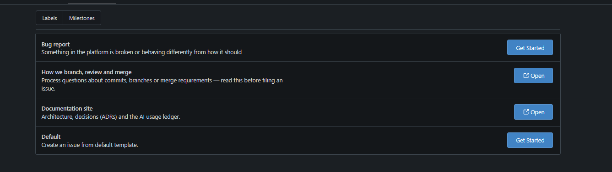

# Testing

What is tested, how the tests run, and the team's test policy. User testing is on [User Feedback](feedback-survey.md).

## At a glance

| Suite | Where | Spec files on `main` | Tests at the Become Pro hand-off (27 Sep) |
|---|---|---|---|
| API unit | `apps/api/src/**/*.spec.ts` | 61 | 974 API tests in total, all passing |
| API end-to-end | `apps/api/test/*.e2e-spec.ts`, against a real Postgres | 19 | (included above; 31 of them for Become Pro) |
| Web components | `apps/web/src/**/*.spec.{ts,tsx}` | 75 | 717, all passing, at 90.2% line and 84.2% branch coverage |
| Python | `test_*.py` in `apps/ingestion`, `predictor`, `optimizer` and `valuation` | 20 | Run locally with `pytest`; `apps/valuation` has 24 |
| Live browser | Headless Edge against the real stack | — | 65 of 65 checks passed |

CI fails if any API or web test fails, or if either app drops below **80%** lines, statements, functions or branches.

## Strategy

| Layer | What it catches | Tooling |
|---|---|---|
| **Unit** | Logic bugs in services, utilities and pure functions | Vitest |
| **End-to-end** | Broken routes, query errors, auth guards that let the wrong caller in, wrong status codes | Vitest, Supertest and a real Postgres |
| **Component** | Rendering bugs, broken interactions, missing accessibility attributes | Vitest, React Testing Library and jsdom |

Unit tests never start the database, and end-to-end tests never import a React component.

## API tests

**Unit specs** sit next to the code they test and never start Nest, a database or HTTP. They cover:

- the admin workflow: batch review, event corrections and their rules, anomaly flags, and recomputing only the affected players' stats;
- the guards: API key with rate limit and quota, version negotiation, roles, origin check, session-or-key;
- custom statistics: the hand-written expression parser (no `eval`) and the identifier allow-list;
- datasets, analytics (model accuracy, leaderboard), pick grading, saved lineups, player stats, the response cache, the exception filter, and Become Pro's valuation.

**End-to-end specs** boot the real `AppModule` and send HTTP requests with Supertest. Examples:

- `/v1/admin/*` rejects a non-admin;
- the full event-correction workflow (preview, apply, undo);
- dataset checksums are reproducible;
- the public API still matches its generated OpenAPI document;
- Become Pro data stays private between two users.

**Infrastructure:**

- `createTestApp()` starts the same Express 5 adapter and exception filter as production.
- `global-setup.ts` runs `prisma migrate deploy` once before the suite.
- `resetDatabase()` truncates every table after each test.
- Spec files run one at a time (`fileParallelism: false`) so they don't race on the shared database.
- The response cache switches itself off under Vitest.

## Web tests

Specs use React Testing Library and find elements the way a user would, by role, label and text. They cover every page, the Home dashboard cards, the landing sections, the Become Pro components and the API client modules.

**Accessibility:** `src/test/accessibility.ts` runs `axe-core` in the specs for Home, Players, Optimizer, Predictions and every Become Pro component. Lighthouse also scored Home, Teams, Players and Admin 100 for accessibility ([Performance](design/performance.md)).

## Become Pro

[Become Pro](become-pro/index.md) is tested at every layer above. It also has the valuation model's own Python suite (24 tests) and a scripted run in a real browser.

On 26–27 September a headless Edge browser drove the web app, API and a Postgres filled by the `nba_api` pull, with two real signed-in users. It ran on a local stack, not production. The 65 checks covered:

- the season and its 10-game floor;
- editing, validating and deleting games;
- changing the competition level;
- comparables linking to real players;
- the Home and Profile cards agreeing with the page;
- phone width;
- privacy between the two users.

The run found five bugs, all fixed before hand-off. The rookie scale was 11% high and a year out of date. The value range wasn't clamped. History points repeated. One sentence was printed twice. The phone layout buried the value card. The run is in the [Become Pro transcript](transcripts/ai_transcripts/kiran-2026-09-27-become-pro.txt).

## Running tests

API tests need a throwaway Postgres:

```bash
docker run --rm -d --name nba-test-db -p 55433:5432 \
  -e POSTGRES_USER=postgres -e POSTGRES_PASSWORD=postgres \
  -e POSTGRES_DB=nba_analytics_test postgres:16-alpine

cd apps/api
cp .env.test.example .env.test   # points at localhost:55433
npm run test        # or test:watch, or test:cov for coverage
```

Web tests need nothing else: `cd apps/web && npm run test`.

In CI, the `coverage` job starts its own `postgres:16-alpine` container and runs `npm run test:cov` for both apps. It then merges the two coverage reports into one HTML report, uploaded as an artifact. See [CI/CD Pipeline](ci-cd.md).

Coverage uses Vitest's v8 provider. It leaves out bootstrap files, Nest module declarations, the BetterAuth wiring, the Prisma client, shadcn/ui primitives, type declarations and the tests themselves.

## Test policy

The [Definition of Done](definition-of-done.md) and PR review enforce this.

| Change | Minimum test |
|---|---|
| New API endpoint | An end-to-end spec for the happy path and one error case (400, 403 or 404) |
| New service method | A unit test of the logic, plus an end-to-end test if it touches the database |
| Bug fix | A regression test that fails without the fix |
| New UI component | A component test of its rendering and main interactions |
| Auth or role change | An end-to-end test that the route rejects the wrong caller |
| Configuration change | No test, but checked by hand |

Conventions:

- `*.spec.ts` for unit and component tests, `*.e2e-spec.ts` for end-to-end tests.
- No test depends on another's data.
- End-to-end tests boot the real app, not a mock.
- A flaky test is a bug.

Python tests are not run in CI yet.

## Bug tracking

Bugs go in the [Gitea issue tracker](https://sdp.ms.wits.ac.za/innovation/sportsanalytics/issues) (needs a login) through a **Bug report** form, `.gitea/ISSUE_TEMPLATE/bug_report.yaml`:



The form asks for:

- the environment (deployed or local, which use separate databases);
- the commit or branch;
- steps to reproduce;
- expected and actual behaviour;
- logs as text.

Security problems go to the team directly, not into a public issue.

Labels are set from the sidebar so issues can be filtered:

- **Priority**, exactly one: `priority/critical` (production down), `priority/high` (needed for this sprint's demo), `priority/medium`, `priority/low`.
- **Component**, any that apply: `ui`, `backend`, `api-service`, `database`, `auth`, `models`, `ingestion`, `ci/cd`, `deployment`, `testing`.

Example: [issue #83](https://sdp.ms.wits.ac.za/innovation/sportsanalytics/issues/83), "age not appearing on all player comparisons" (`bug`, `priority/high`, `ui`), was filed on 5 Sep against the deployed site and closed on 8 Sep.

---

*AI Declaration: The preceding document was generated with the assistance of the following: Qoder[Qoder Lite], Claude-Code[Claude Sonnet 5], Claude-Code[Claude Opus 5.5]*
