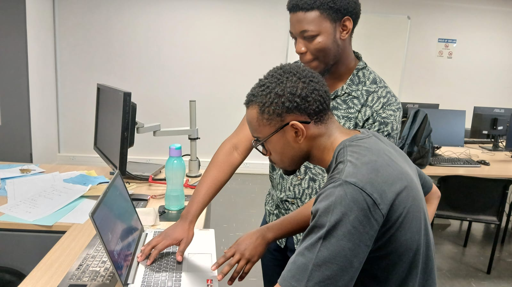
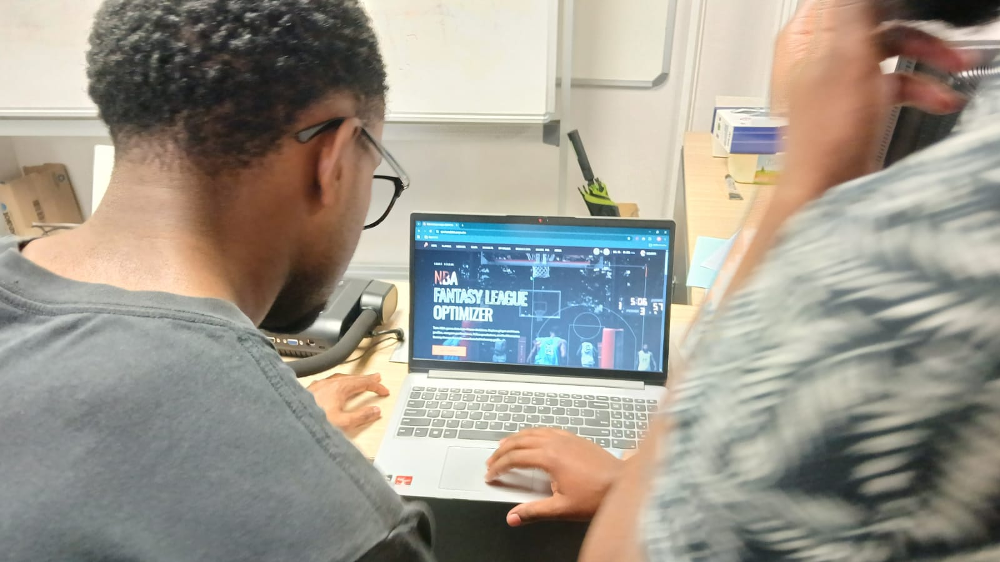

# User Interviews

One-on-one follow-up interviews with [survey](feedback-survey.md) respondents who volunteered their contact details (Q25) — the qualitative second half of the [user feedback process](user-feedback-methodology.md). Sessions are hands-on: the participant drives the live app while thinking aloud, which catches the comprehension and discoverability problems a screenshot-based survey structurally cannot.

---

## Interview 1 — 2026-09-27

| | |
|---|---|
| **Participant** | The survey respondent who volunteered for a follow-up (novice segment — mirrors the survey's dominant profile) |
| **Format** | Hands-on walkthrough of the live app at [sportsanalytics.pages.dev](https://sportsanalytics.pages.dev/), participant narrating first impressions page by page |
| **Method** | Think-aloud — the participant said what they expected each page to do before and while using it |
| **Evidence** | Two session photographs — see [Session evidence](#session-evidence) below |

### Session evidence

Quotes below are as captured in the session minutes (lightly cleaned).

### What landed well

- **The loading experience.** The bouncing-ball loader and the blur-up image loading were both spontaneously called out as cool
- **Onboarding.** Picking a favourite team was easy
- **Player comparison.** The trait radar "is cool", and the abbreviation explanations beside it were appreciated — the exact pattern F7 asks to extend site-wide
- **Players list.** The league-leader view is clear
- **Predictions page.** "Top 5 to watch" landed — the participant briefly wondered whether the stats were for the previous or the next match and found the answer in the card's own label ("oh wait, it says it there"); "your matchup" showing the team and its next game was understood; the model-predictions view separating correct from incorrect calls was valued
- **Profile page.** "I like this"
- **Final note.** The accessibility features are good, and the UI is "thoughtful — easy to find and move around"

### Confusion and comprehension gaps

**Home dashboard**

- "Beat the Model" is opaque — the participant could not tell what it meant until it was explained live
- The model's win-probability figure on the card ("model GSW %") was confusing — what does the number actually mean?

**Players list**

- The leaderboard graphs do not reflect what the participant searched or filtered for — they expected the chart to follow their selection
- Player profiles were missed entirely: the participant did not know profile pages existed until shown. Once shown: "this is useful information — a lot of it", with the season splits read as "just different tournaments I guess" (close enough to correct)
- Player headshots are too small on desktop (fine on mobile)

**Teams list**

- The participant expected their favourite team at the top of the list; discovering it is sorted by Elo prompted "what's the difference between win percentage and Elo?"

**Data set page**

- First reaction: "what is this?" — the page's purpose is not self-explanatory
- How is the data sorted? Can it be downloaded to see what it looks like?
- **Bug:** a season that has not started yet was listed as if already ingested
- **Bug:** a season download failed because a stat had been edited (the editable-stats feature) and the export could no longer be reproduced — nothing was downloaded

**Optimiser**

- "What does *optimal lineup* mean?" — the core concept is not explained in-app
- The page assumes fantasy-sports literacy: "if a person doesn't play fantasy [sports], then they don't know how to play fantasy NBA"
- The editable budget puzzled them — budget editing is not a thing in real fantasy formats
- Blunt summary: "this is not fantasy basketball, this is just a little minigame" — the optimiser does not model a real fantasy NBA format, and a fantasy-experienced user will notice

**Predictions page**

- Dropdowns and search controls are hard to see and read

**Become Pro page**

- The participant was lost: "is this fantasy basketball? No. What is this?" — the page had to be explained live

**API access**

- The participant wanted API access to public data without logging in: "why must we log in to get an API key and what does that do for us? We need an API even for info that is not private" — it is currently unknown to a user how to get API access without an account

### New feedback items (F20–F31)

| ID | Feedback (source) | Category | Action | Status |
|---|---|---|---|---|
| F20 | "Beat the Model" name and the model's win-probability label ("model GSW %") are opaque without explanation | UX / Copy | Rename the feature or add a one-line explainer on the card; label win probabilities in plain language | Backlog — file as Gitea issue |
| F21 | Player headshots too small on desktop (fine on mobile) | UX | Desktop sizing pass on headshots | Backlog — file as Gitea issue |
| F22 | Leaderboard graphs don't reflect the user's search/filter selection | Feature | Wire the players-list leaderboard chart to the active selection | Backlog — file as Gitea issue |
| F23 | Teams list sorted by Elo confuses — expected favourite team first; "what's the difference between win percentage and Elo?" | UX / Feature | Sort/search controls (including "my teams first") plus a short Elo explainer; extends F13's standings request | Backlog — file as Gitea issue |
| F24 | Data set page purpose unclear — "what is this?", how is the data sorted, can it be downloaded | UX / Docs | Framing copy, sort explanation, and a clear download affordance | Backlog — file as Gitea issue |
| F25 | A season that hasn't started is listed as if already ingested | Bug | File as a Gitea bug report (data integrity) | Backlog — file as Gitea issue |
| F26 | Season download fails after a stat is edited — the export can't be reproduced and nothing downloads | Bug | File as a Gitea bug report; likely an interaction with the editable-stats feature (PR #81/#85/#107) | Backlog — file as Gitea issue |
| F27 | Optimiser reads as "a minigame, not fantasy basketball" — "optimal lineup" unexplained, fantasy literacy assumed, editable budget isn't a real fantasy rule | UX / Scope | In-app onboarding copy plus a scope decision: model a real fantasy NBA format or reframe the feature honestly; extends F9 | Backlog — file as Gitea issue |
| F28 | Dropdowns and search controls on the predictions page are hard to see and read | UX / Accessibility | Contrast/readability pass on form controls; extends F7 | Backlog — file as Gitea issue |
| F29 | Become Pro page purpose unclear — "is this fantasy basketball? no. what is this?" | UX / Copy | Explainer and clearer labeling for the self-upload feature | Backlog — file as Gitea issue |
| F30 | Player profiles not discoverable — the participant didn't know they existed until shown | UX / Discoverability | Make profile pages discoverable from the players list (explicit affordance on each card) | Backlog — file as Gitea issue |
| F31 | Public data behind login — "we need an API even for info that is not private" | API / Access | Verify public endpoint coverage (read-only game endpoints were made public in PR #99), document how to call the public API without an account, and evaluate what genuinely requires auth | Verify + evaluate |

### What the interview confirmed

- **The novice-onboarding gap (F8/F9) is real and page-specific.** Beat the Model, the optimiser, and Become Pro each needed live explanation — mirroring the survey's polarised Beat-the-Model engagement scores (five 5s, four 3s)
- **The readability gap (F7) extends beyond stat labels** to form controls (F28) and headshots (F21)
- **The fix F7 asks for already exists in-app.** The compare page's abbreviation explanations were praised — extend the pattern rather than invent a new one
- **Hands-on testing finds what screenshots cannot.** The survey reported zero bugs across 11 respondents; one hands-on session surfaced two real ones (F25, F26) — exactly the disambiguation the survey's "not hands-on" limitation predicted

### Interview-sourced changes

None shipped yet — all twelve items are queued for triage alongside the survey backlog (F3–F14, F16, F18) into Gitea issues, per the [integration process](testing.md#how-feedback-is-integrated).

---

*AI Declaration: This page was created with the assistance of Qoder[Qoder Lite].*
